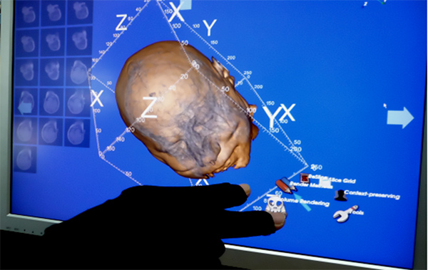
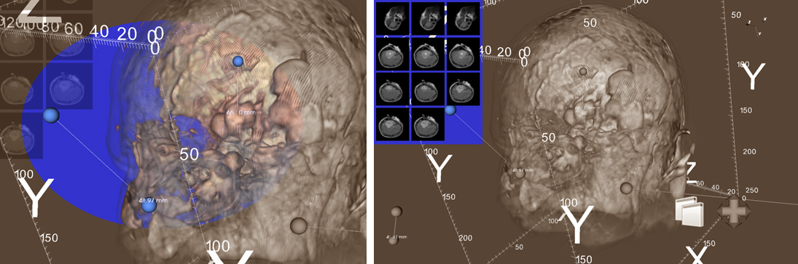

## Description

Glove interface is a continuous-input device detecting the motions of fingers and the wrist of human hand. This device has its merit in 3D systems, as it would be used to provide diverse user interaction based on hand gestures without external physical devices. However, it can suffer from inaccurate input caused by continuous motion of human hand. It also needs additional input devices, such as position trackers, to obtain 3D information used for navigation or selection tasks of 3D systems. In this case, the input space of glove interface can be restricted to the specification of position trackers or other devices used in 3D systems.

In this research, we introduce a interaction technique based on "All-actions-in-one-hand" (AAIOH) interface for performing every tasks of 3D systems in one hand wearing glove interface. AAIOH interface has three function parts; conceptual metaphor indicating the ways that user interacts with virtual environment, hierarchical menu system using finger bend and multimodal feedback for complementing indirect user interaction based on AAIOH interface. We also evaluate AAIOH interface with a medical image manipulation system using volume rendering. AAIOH interface makes users easily learn and perform various tasks of 3D systems with consistent and simple hand gestures of high accuracy in detecting.

> 
> Interaction with medical image dataset using glove interface

> 
> (Left) Measurement tool. (Right) 2D image viewer.

## Contact

Jaeil Kim (threeyears at kaist.ac.kr)

## Publications

- Jaeil Kim, Jinah Park, "All-actions-in-one-hand interface for 3D systems and glove interface (3차원 시스템과 글러브 인터페이스를 위한 "All-actions-in-one-hand" 인터페이스)," HCI Korea 2010, pp. 127-129, 2010.