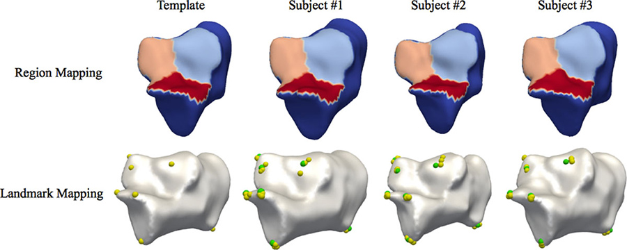
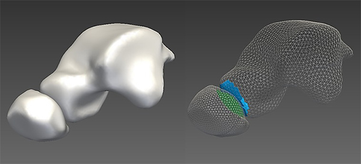
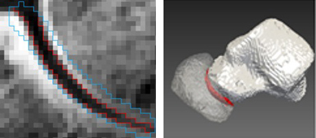
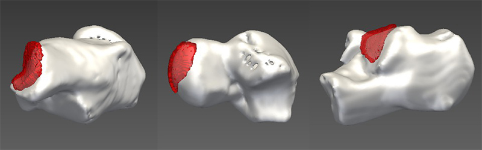
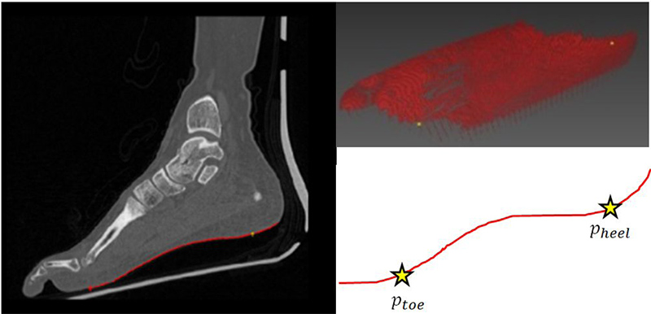
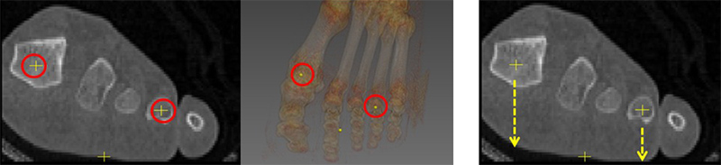
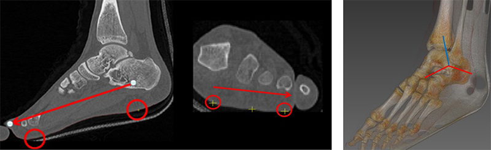

## Description

In the bone shape morphology, the morphological difference of the bones across subjects is quantified by the geometric measures, such as the curvature of the articular surface and the relative bone orientation in joints, defined with the anatomical landmarks and regions on the bone surface. However, the landmark and region determination on individual cases is a difficult and time-consuming task, because of the various size and shape of the bones and operator’s errors.

To address this problem, we introduce our template-based shape modeling framework to a posture and gait analysis on foot bones and joints to automatically determine region landmarks (e.g. articular surfaces) of bones on their surfaces. We proposed a landmark and region mapping method based on a non-rigid template-to-image registration, an automated method for extracting the joint space by applying graph cut on Markov random field model, and reliable measurement of 3D foot bone angles.

> 
> Articular surface and landmarks, which are automatically identified for the calcanei of 3 subjects

> 
> Template model of talus and navicular with the articular surfaces encoded

> 
> Joint space extraction results. (a) Specified ROI (blue) and extracted joint space (red) between the bones using the proposed method. (b) Separated bone segments shown in 3D.

> 
> 3D visualization of the segmented joint space (shown in red) using the proposed method. From left to right, calcaneocuboid joint, talonavicular joint, and talocalcaneal joint.

> 
> Extracted sole (red) and two feature points (yellow)

> 
> (Left) Centers of hallux and 4th toe. (Right) Refined position of hallux and 4th toe (the tips of the arrows).

> 
> (Left) Directions of the 1st and the 2nd axes with the extracted feature points. (Right) The 3rd axis is a distal to proximal direction, which is a cross product of the 1st and the 2nd axes.

## Contact

Taeho Kim (kdhtheo at kaist.ac.kr)

## Publications

- Sang Gyo Seo, Jaeil Kim, Dong Yeon Lee, Ho Seong Lee, Woo Chun Lee, Jinah Park, "Weight-bearing 3D Foot Model Reconstruction from Simple Standing Radiographs Using Deformable Surface Fitting Method," 6th Asian Federation of Foot and Ankle Surgeons (AFFAS), November 2016.
- Sang Gyo Seo, Jaeil Kim, Chang Hyun Ryu, Eo Jin Kim, Doojae Lee, Dong Yeon Lee, Jinah Park, "Weight-Bearing 3D Foot Model Reconstruction From Standing Radiographs Using Deformable Surface Fitting Method," AOFAS Annual Meeting 2016, July 2016.
- Sang Gyo Seo, Jaeil Kim, Chang Hyun Ryu, Dong Yeon Lee, Jinah Park, "Weight-bearing 3D foot reconstruction from standing radiograph using deformable surface fitting," Foot International (i-FAB) 2016, June 2016.
- Taeho Kim, Dong Yeon Lee, Jinah Park, "Reliable measurement of 3d foot bone angles based on the frame-of-reference derived from a sole of the foot," SPIE Medical Imaging 2016, Proc. SPIE, Vol. 9785, pp. 97853F:1-97853F:7, February 2016.
- Eunbi Park, Taeho Kim, Jinah Park, "Template-based automatic extraction of the joint space of foot bones from CT scan," SPIE Medical Imaging 2016, Proc. SPIE, Vol. 9784, pp. 97841U:1-97841U:7, February 2016.
- Uitae Kim, Jinah Park, "템플릿 모델 변형을 통한 환자 맞춤형 척추 모델링," 2015 KSIIM Workshop (2015년도 대한의학영상정보학회 학술대회), pp. 128-129, August 2015.
- Dong Yeon Lee, Taeho Kim, Sang Gyo Seo, Eo jin Kim, Woo-chun Lee, Keith Wapner, Jinah Park, "3D Computational Position Analysis based on the Articular Surface of Tarsal Bone: A Preliminary Study," AOFAS Annual Meeting 2015, July 2015.
- Jaeil Kim, Sang Gyo Seo, Dong Yeon Lee, Jinah Park, "Anatomical landmark and region mapping based on a template surface deformation for foot bone morphology," AOFAS Annual Meeting 2014, September 2014.
- Jaeil Kim, Sang Gyo Seo, Dong Yeon Lee, Jinah Park, "Template-based landmark and region mapping of bone," Journal of Foot and Ankle Research (4th Congress of the International Foot and Ankle Biomechanics (i-FAB) Community), Vol. 7(Suppl 1), pp. A42:1-A42:2, April 2014.
- Jaeil Kim, Neil Roberts, Jinah Park, "Template Surface Model-based 3D Shape Reconstruction of Upper Cervical Spine (탬플릿 표면 모델 기반 3차원 상부 경추 형태 복원 기법)," The 43rd KOSOMBE Conference (2011년 대한의용생체공학회 춘계학술대회), May 2011.