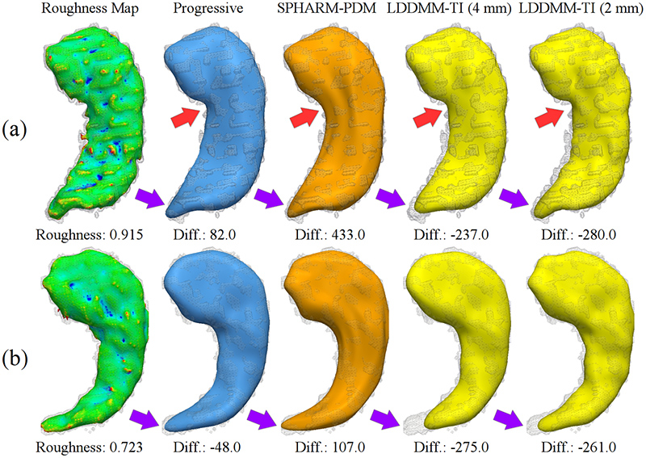
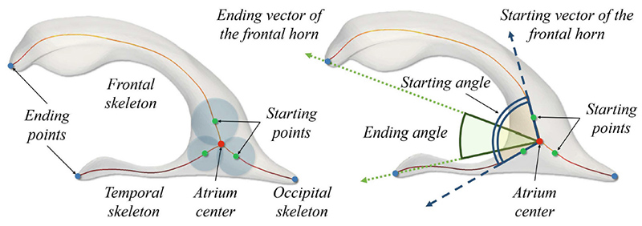
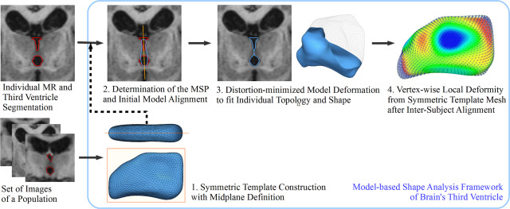

## Description

Brain shape morphometry has emerged as a preferred tool to investigate the morphological changes of them with respect to pathological processes (e.g. neurodegenerative diseases and aging). Various methods have been proposed in this field, but it is still challenging in estimating accurate and smooth surface boundaries against rough boundaries and in achieving good anatomical correspondence between the individual models. In addition, the sensitivity and comparability of the geometric measures, which quantify the shape differences between subjects, need to be validated and guaranteed for the comparison of the individuals'shapes with anatomical knowledge.

The objective of this research is to develop computational models to address these issues in the brain shape morphometry. Our approach can be defined as a template-based shape modeling and measurement. For this objective, we develop deformable surface models using a “progressive surface deformation” to reconstruct the target shapes robustly while preserving the geometric details of initial models (template models) against size and shape variations across subjects. In addition, we proposed structural feature descriptors and anatomical landmarks, anatomically and geometrically defined on the template models, to investigate the shape characteristics and changes of the brain ventricles with explicit measurement basis on anatomical knowledge. The proposed feature descriptors and landmarks guarantee the comparability and consistency across subjects. More specific information can be found in relevant papers.

Currently, we validated the accuracy, robustness and clinical consistency of the proposed methods on the human data of hippocampus and brain ventricles, collected from the Lothian Birth Cohort 1936 (LBC 1936) study by collaborating with the Centre for Clinical Brain Sciences (University of Edinburgh).

> 

> 

> 

> 

> 

> 

## Project Page

http://cgv.kaist.ac.kr/brain

## Contact

Jaeil Kim (threeyears at kaist.ac.kr)

## Publications

- Jaeil Kim, Maria del C. Valdés Hernández, Natalie A. Royle, Susana Muñoz Maniega, Benjamin S. Aribisala, Alan J. Gow, Mark E. Bastin, Ian J. Deary, Joanna M. Wardlaw, Jinah Park. "3D shape analysis of the brain's third ventricle using a midplane encoded symmetric template model," Computer Methods and Programs in Biomedicine, Vol. 129, pp. 51-62, June 2016.
- Peter Jaehyun Lee, Hojin Ryoo, Jinah Park, Yong Jeong, "Hippocampal structural differences in early versus late MCI," 2015 Annual Meeting of Korean Society of Human Brain Mapping (2015년도 대한뇌기능매핑학회 추계학술대회), November 2015.
- Peter Jaehyun Lee, Hojin Ryoo, Jinah Park, Yong Jeong, "Differences in hippocampal surface and white matter structure in early and Late MCA: ADNI Study," The 34th Annual Meeting of the Korean Neurological Association (2015년도 대한신경과학회 추계학술대회), November 2015.
- Jaeil Kim, Maria del C. Valdés Hernández, Natalie A. Royle, Jinah Park, also The Lothian Birth Cohort 1936 Collaborative Group and The Alzheimer's Disease Neuroimaging Initiative, "Hippocampal Shape modeling based on a Progressive Template Surface Deformation and Its Verification," IEEE Transactions on Medical Imaging, Vol. 34, No. 6, pp. 1242-1261, June 2015.
- Jaeil Kim, Hojin Ryoo, Jinah Park, "Current research on 3D organ shape modeling and its applications," The 15th Germany-Korea Joint Workshop on Medical Image Analysis and Cognition-Guided Surgery, October 2014.
- Jaeil Kim, Hojin Ryoo, Maria del C. Valdés Hernández, Natalie A. Royle, Jinah Park, "Brain Ventricular Morphology Analysis Using a Set of Ventricular-Specific Feature Descriptors," The 6th International Symposium on Biomedical Simulation (ISBMS 2014), Lecture Notes in Computer Science, Vol. 8789, pp. 141-149, October 2014.
- Maria C. Valdés Hernández, Jaeil Kim, Natalie A. Royle, Hojin Ryoo, Susana Muñoz Maniega, Benjamin S. Aribisala, Mark E. Bastin, Jinah Park, Ian J. Deary, and Joanna M. Wardlaw, "Novel surface modelling of the brain’s third ventricle reveals local morphological differences in an ageing sample," The 20th Annual Scientific Meeting of the British Chapter of the ISMRM, September 2014.
- Maria del C. Valdés Hernández, Jaeil Kim, Ian Whitteford, Xinyi Qiu, Joanna M. Wardlaw, Jinah Park, "Automatic hippocampal multimodal assessment for studies of stroke and small vessel disease," Medical Image Understanding and Analysis 2014, pp. 33-38, July 2014.
- Peter Jaehyun Lee, Hojin Ryoo, "Classification of EMCI & LMCI in Alzheimer’s Disease Using Structural MRI & DTI (자기공명영상과 확산텐서영상을 이용한 Early와 Late 경도 인지장애 구분)," The 28th KSIIM Workshop (2014년도 대한의학영상정보학회 학술대회), July 2014.
- Hojin Ryoo, Jaeil Kim, Maria del C. Valdés Hernández, Jinah Park "Lateral Ventricle의 형상 복원 및 분석에 대한 연구 및 고찰," The 27th KSIIM Workshop (제27회 대한의학영상정보학회 학술대회), pp. 79-80, July 2013.
- Jaeil Kim, Jinah Park, "Shape correspondence preserved 3D Deformation Modeling Technique for Shape-based Morphometry Study on Small Brain Structures (뇌 소형 구조에 대한 형상 기반 형태 계측 연구을 위한 형상 대응성 유지 3차원 가변형 모델링 기법)," KCGS 2013 (한국컴퓨터그래픽스학회 2013 학술대회), pp. 151-152, June 2013.
- Maria del C. Valdés Hernández, Jaeil Kim, Natalie A. Royle, Hojin Ryoo, Susana Muñoz Maniega, Benjamin S. Aribisala, Mark E. Bastin, Ian J. Deary, Jinah Park, Joanna M. Wardlaw, "Novel surface mesh model helps characterising regional atrophy in hippocampus and 3rd ventricle of normal older individuals," SINAPSE Annual Scientific Meeting, May 2013.
- Jaeil Kim, Jinah Park, "라플라시안 변형 기법 기반 인체 장기 형태 모델링," KSIIM Joint Workshop 2012 (2012년도 의학영상 및 의료로봇분야 공동학술대회), pp. 76, July 2012.
- Jaeil Kim, Joon-Kyung Seong, Jinah Park, "Coupled Surface Reconstruction for Subcortical Shape Analysis," The 14th Korea-Germany Joint Workshop on Advanced Medical Image Processing, pp. 27-34, October 2011.
