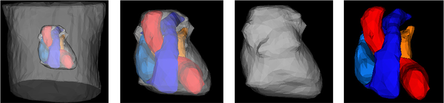
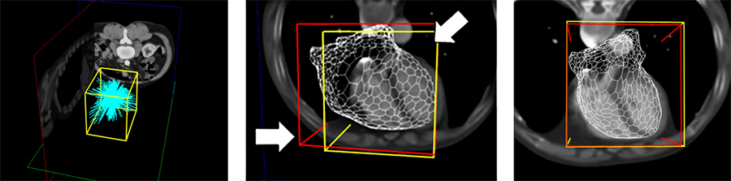
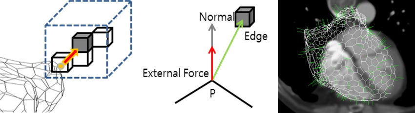
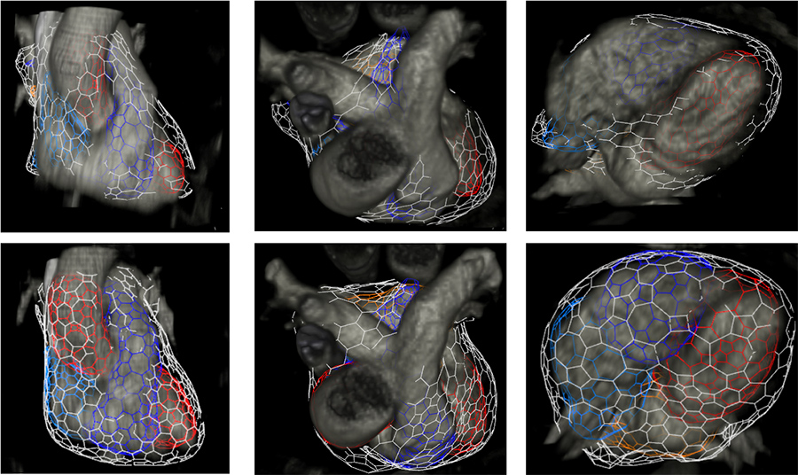

## Description

We present a method to automatically construct a patient-specific three-dimensional (3D) mesh model of a human thorax and a heart consisting of pericardium and four chambers. We represent the standard thorax model by simplex meshes, and deform them to fit into the individual CT data to reconstruct accurate surface representations for the MCG conductor model. The deformable simplex mesh model deforms based on the external forces exerted by the edge and gradient components of the source volume data while its internal force acts to maintain the integrity of the shape. However, image driven deformation is often very sensitive to its initial position. Therefore, we suggest our solution to automatic region-of-interest (ROI) detection using search rays, which are casted to 3D volume images to identify the region of a heart based on both the radiodensity values and their continuity along the path of the rays. Upon automatic ROI detection with search rays, the initial position and orientation of the standard mesh model is determined, and each vertex of the model is respectively moved by the weighted sum of the internal and external forces to conform to the each patient's own thorax and heart shape while minimizing the user's input.

> 

> 

> 

> 

## Contact

Jaeil Kim (threeyears at kaist.ac.kr)

## Publications

- Jaeil Kim, Seokyeol Kim, Kiwoong Kim, Jinah Park, "Automated 3D Heart Segmentation by Search Rays for Building Individual Conductor Models," SPIE Medical Imaging 2009, Proc. SPIE, Vol. 7261, pp. 72611W:1-72611W:8, February 2009.
- Seokyeol Kim, Jaeil Kim, Jinah Park, "Automated 3-D Cardiac Segmentation using Search Rays," International Forum on Medical Imaging in Asia (IFMIA) 2009, IEICE Technical Report, Vol. 108, No. 385, pp. 311-314, January 2009.
- Seokyeol Kim, Jaeil Kim, Jinah Park, "Automated 3-Dimemsional Heart Segmentation by Search Rays (Search Rays를 이용한 자동화된 3D 심장 세그멘테이션)," KCGS 2008, July 2008.
- Jaeil Kim, Jinah Park, "Automatic heart 3D segmentation system using heart area detection with search rays and deformable model with simplex mesh (자동 심장 세그멘테이션을 위한 Search Rays 기반 심장 위치 정보 검출 및 Simplex Mesh 가변 모델)," 2008 KSIIM Joint Workshop (의학영상정보 분야 공동학술대회), June 2008.