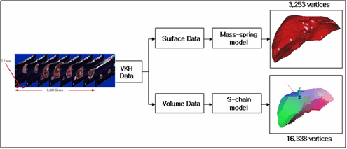
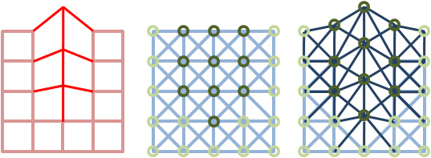
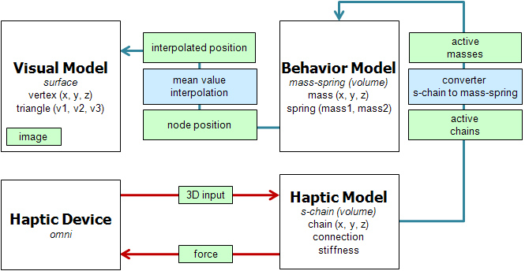
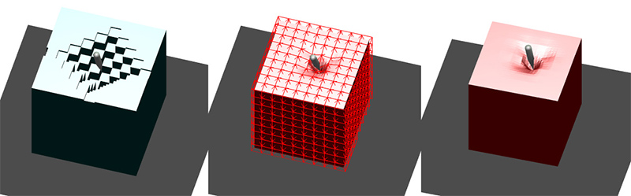
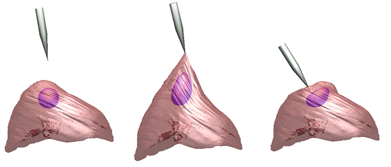

## Description

In medical education, much training is advisable before real medical practice since operating on actual patients causes many medical errors. The current medical trainings have been done with cadavers and laboratory animals which is expensive and raises ethical issues. Therefore, our project proposes the medical simulation for training cheaper, more safe and easier than the current medical trainings.

The physics based accurate deformable model, volume data based modeling and haptic feedback will accomplish realistic simulation. Since they have a big computational complexity, we should accomplish optimized and heuristic algorithms for real-time simulation. As a result, proposed hybrid model will handle the high resolution volumetric objects with haptic feedback and show the realistic deformation in real-time.

> 
> Dual deformable model that consists of the mass-spring model and the S-chain model

> 
> Adaptive mass-spring model

> 
> Overview of the hybrid deformation method

> 
> Deformation of the S-chain model (left) and the mass-spring model (middle and right)

> 
> Deformation of the liver model consisting of heterogeneous tissues

## Contact

Jaehwan Cho (zerodin85 at kaist.ac.kr)

## Publications

- Jaehyun Cho, Jinah Park, "A Mode Selection Method for Adaptive Deformation with Reduced Deformable Models," The 25th International Conference on Computer Animation and Social Agents (CASA 2012), May 2012.
- Seok Kim, Jinah Park, "Real-time Collision Detection of Deformable Objects for Haptic Rendering using Distance Field and Point Shell (햅틱 렌더링을 위한 거리 영역과 포인트 쉘 기반의 실시간 변형체 충돌 검사)," Journal of KIISE: Software and Applications, Vol. 38, No. 7, pp. 358-368, July 2011.
- Jaehwan Cho, Jinah Park, "Hybrid Elastic Model for Volumetric Deformation in Multi-modal Virtual Reality Simulation," IFMBE Proceedings (World Congress on Medical Physics and Biomedical Engineering 2009), Vol. 25, No. 4, pp. 1528-1531, September 2009.
- Jaehwan Cho, Jinah Park, "Adaptive Mass-Spring Method for the Synchronization of Dual Deformable Model (듀얼 가변형 모델 동기화를 위한 적응성 질량-스프링 기법)," Journal of Korea Computer Graphics Society (한국컴퓨터그래픽스학회논문지), Vol. 15, No. 3, pp. 1-9, September 2009.
- Jaehwan Cho, Seok Kim, Jinah Park, "Hybrid Elastic Model for Volumetric Deformation and Real-time Haptic Simulation (볼륨 변형과 실시간 햅틱 시뮬레이션을 위한 하이브리드 탄성체 모델)," HCI Korea 2009, pp. 68-73, February 2009.
- Jaehwan Cho, Jinah Park, "Embedded Spring-Mass on S-Chain model for Real-time Haptic and Volumetric Deformable System," The 11th Germany-Korea Joint Workshop on Advanced Medical Image Processing, September 2008.
- Sangyoun Kim, Sekil Park, Jaewhan Cho, Jinah Park, "Hybrid Deformable Model for Volumetric Haptic Rendering and Surface Graphic Rendering," The 10th Korea-Germany Joint Workshop on Advanced Medical Image Processing, July 2007.
- Sang-Youn Kim, Segil Park, Dong-Soo Kwon, Jinah Park, "A Hybrid Approach for Real-time Haptic and Graphic Simulator in Virtual Environment," IEEE ROMAN 2007, pp. 316-319, May 2007.