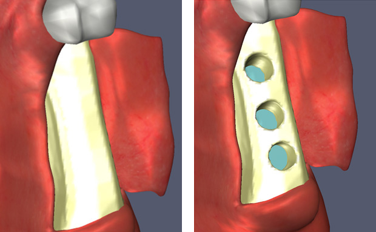

## Description

Mechanical removal of bone material is the most critical procedure during dental implant surgery because it can jeopardize patient safety in several ways such as damage in the mandibular canal and piercing of the maxillary sinus. With recognition of the effectiveness in virtual training, many simulators with haptic feedback have been proposed. Although there are many varieties in drill bits, most of previously developed simulators consider only a spherically shaped tool due to its simplicity in tool-bone interaction.

We propose a new simulation method that can handle any arbitrarily shaped tools with multiple contacts between the tool and the bone. The tool is represented by a signed-distance field, and the bone is represented as voxels surrounded by a point shell. Upon chipping away bone elements, the point shell is updated reflecting the deformation of bone in real-time, while the collision detection and the reflected force is efficiently and accurately computed from the distance field encoded in the tool.

> 
> Implant surgery simulator

The figures below show results of bone drilling. The high-quality mesh is generated from the distance fields using surface reconstruction techniques such as marching cubes. To represent shape deformation of the bone, we apply CSG difference operation locally to bone and tool distance fields.

> 
> Alveolar bone before drilling. (Right) Alveolar bone after drilling.

Also we developed a dental simulator for training of two prevalent interventions: tooth restoration, and ultrasonic scaling. Users can choose one of six different kinds of instruments: a mouth mirror, an explorer, a bur, a spoon excavator, an ultrasonic scaler, and forceps during training. As shown in the figure below, the training of tooth restoration includes a sequence of steps: tooth palpation, preparation, caries removal, caries detection, bonding, gold inlay, and dental polishing.

> 
> Procedures of tooth restoration

All steps provide 3D animations with a description of its intervention, which helps trainee to develop and acquire technical skill and surgical judgment. Haptic training is provided for six steps (except two steps: caries detection and bonding) hand skills are essential. Since the residents and dentists are required to practice and master to control the vibration and motion of the hand piece to generate a cavity in the tooth, the tooth preparation is one of the most essential procedures that should be offered from a dental simulator.

Our training program provides the removal ratio of tooth volume, caries, and cavity, and also the excessive removal ratio of a tooth. This information can be used to assess the dexterity of the user. The training of ultrasonic scaling consists of exploring, probing, ultrasonic scaling, and cleaning. Except probing step, all the other steps include both 3D animations and haptic simulations. A snap shot of scaling simulation is shown in the figure below.

> 
> Ultrasonic scaling

A Phantom Desktop was used to display haptic feedback. Moreover, immersive workbench, SenseGraphics Display 300, was used to align hand-eye coordination as shown in the figure below.

> 
> Dental surgery and care training simulator

## Contact

Kimin Kim (kiminkim at kaist.ac.kr)

## Publications

- Kimin Kim, Jinah Park, "Fracture Toughness Evaluation Technique for Real-Time Bone Cutting Simulation (실시간 뼈 절삭 시뮬레이션을 위한 파괴인성 평가 기법)," KCC 2015 (한국정보과학회 2015 한국컴퓨터종합학술대회), pp. 1318-1320, June 2015. (Distinguished Paper Award)
- Kimin Kim, Seokyeol Kim, Jinah Park, "VR-based simulators in medical and industrial fields: dental treatment, rehabilitation, and teleoperation," The 6th Korea Haptics Community (KHC) Workshop (제6회 한국햅틱스연구회 워크샵), December 2012.
- Kimin Kim, Jaehyun Cho, Jaihyun Kim, Jinah Park, "A Dental Simulator for Training of Prevalent Interventions: Tooth Restoration and Ultrasonic Scaling," EuroHaptics 2012, Lecture Notes in Computer Science, Vol. 7283, pp. 195-198, June 2012. (Best Demo Award)
- Kimin Kim, Jaihyun Kim, Jinah Park, "A Collision Model for Real-time Simulation of Tooth Preparation (실시간 치아 형성 시뮬레이션을 위한 충돌 모델)," Journal of KIISE: Computing Practices and Letters, Vol. 17, No. 12, pp. 677-681, December 2011. (KIISE Distinguished Paper Award)
- Kimin Kim, Jaehyun Cho, Jaihyun Kim, Jinah Park, "VR-based Dental Training Simulator," KCC 2011 (한국정보과학회 2011 한국컴퓨터종합학술대회), Demonstration, June 2011. (Distinguished Demonstration Award)
- Jaehyun Cho, Jaihyun Kim, Jinah Park, "Haptic Simulation Algorithm for Tooth Scaling Training (치아 스케일링 훈련을 위한 햅틱 시뮬레이션 알고리즘)," KCC 2011 (한국정보과학회 2011 한국컴퓨터종합학술대회), Vol. 38, No. 1(B), pp. 290-293, June 2011.
- Kimin Kim, Jaihyun Kim, Jinah Park, "A Collision Model for Haptic Simulation of Tooth Preparation (치아 형성의 햅틱 시뮬레이션을 위한 충돌 모델)," KCC 2011 (한국정보과학회 2011 한국컴퓨터종합학술대회), Vol. 38, No. 1(A), pp. 438-441, June 2011. (Distinguished Paper Award)
- Jaehyun Cho, Jinah Park, "Virtual Dental Simulator for Cavity Filling Training," The 4th Korea Haptics Community (KHC) Workshop (제4회 한국햅틱스연구회 워크샵), November 2010.
- Kimin Kim, Jinah Park, "Virtual bone drilling for dental implant surgery training," The 16th ACM Symposium on Virtual Reality Software and Technology (VRST 2009), pp. 91-94, November 2009.
- Kimin Kim, Jinah Park, "Real-time Alveolar Bone Drilling Simulation using a Haptic Device (햅틱 장치를 사용한 실시간 치조골 드릴링 시뮬레이션)," The 2nd Korea Haptics Community (KHC) Workshop (제2회 한국햅틱스연구회 워크샵), June 2009.
- Kimin Kim, Jinah Park, "Virtual Bone Drilling for Dental Implant Training," ASIAGRAPH 2008, Vol. 2, No. 2, pp. 252-256, October 2008.
- Kimin Kim, Ye-Seul Park, Jinah Park, "Volume-based Haptic Model for Bone-drilling," ICCAS 2008, pp. 255-259, October 2008.
- Kimin Kim, Jaehwan Cho, Yeseul Park, Jinah Park, "Real-time haptic rendering of volume deformation and modification (햅틱 렌더링을 위한 장기와 뼈의 실시간 변형 모델)," 2008 KSIIM Joint Workshop (의학영상정보 분야 공동학술대회), June 2008. (Philips Best Demonstration Prize)