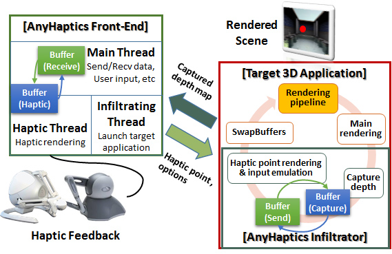
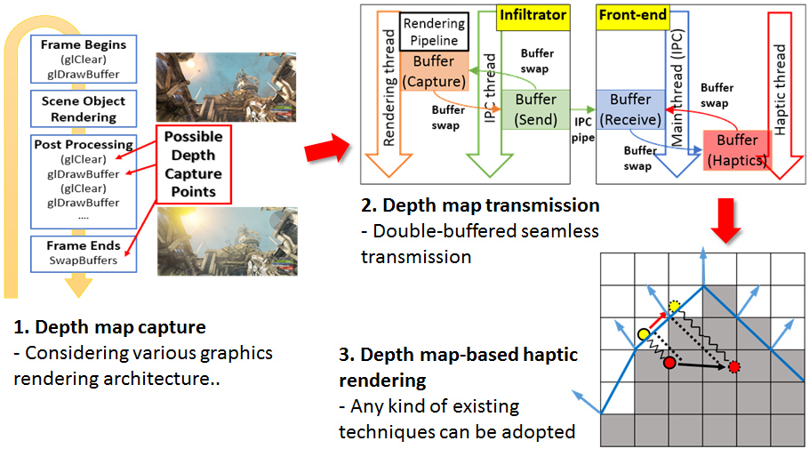
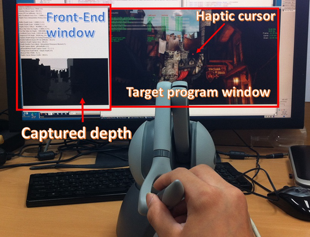

## Description

We present a haptic plug-in system that operates on already-developed existing interactive 3D graphics applications. There are various high-quality graphics applications developed without taking into consideration the haptic features. Our system augments haptic interaction in a simple manner to enhance the experience. The proposed system consists of two separate modules. While one module captures the depth map from a graphics pipeline of the target application, the other module calculates the haptic feedback force based on the captured depth map. We address efficient and effective ways of capturing and transferring depth map data for haptic rendering and present a working solution.

> 
> Overview of AnyHaptics system

> 
> Technical blocks for building the haptics plug-in

> 
> Operation of AnyHaptics system

## Contact

Deok-Jae Song (djsong at kaist.ac.kr)

## Publications

- Deok-Jae Song, "A Haptic Interface Framework for Sensing Movement Behavior from Existing Application Contents," The 2nd Korea-Europe Workshop on Biomedical Informatics and Natural Language Processing, February 2015.
- Deok-Jae Song, Jinah Park, "Haptic Rendering for 2D Application Interface by On-the-fly Layer Interpretation of GUI Element Images (GUI 요소 기반 이미지의 즉석 다층 해석을 통한 2D 인터페이스의 햅틱 렌더링)," HCI Korea 2015, pp. 80-82, December 2014.
- Deok-Jae Song, Jinah Park, "AnyHaptics: A Haptic Plug-in for Existing Interactive 3D Graphics Applications," The 20th ACM Symposium on Virtual Reality Software and Technology (VRST 2014), pp. 27-30, November 2014.
- Deok-Jae Song, Jinah Park, "Haptic Plug-in for Existing Interactive 3D Graphics Applications (기존 대화형 3D 그래픽 어플리케이션을 위한 햅틱 플러그인)," KCGS 2014, pp. 39-40, July 2014.