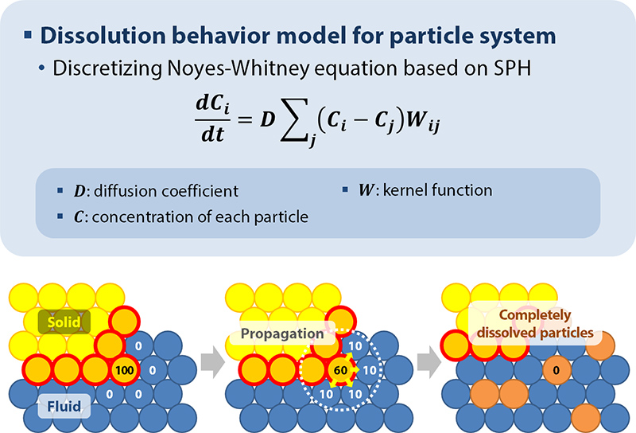
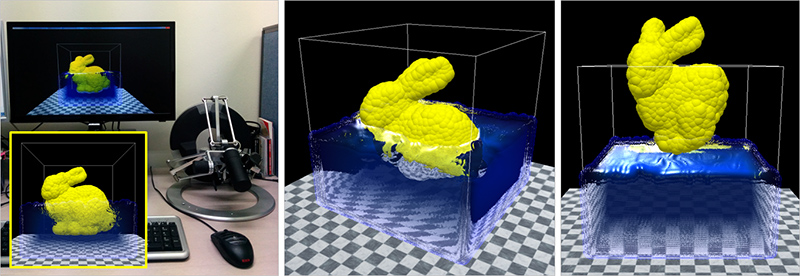

## Description

Interactions among fluids and solids are frequently observed around our daily life and simulated for various purposes. However, real-time simulation of dissolution phenomena, including erosion and liquefying, is restrictively allowed due to the complexity of the behavior model. To lessen this limitation, we suggest a particle-based dissolution model for real-time interaction between the fluids and the soluble solid objects. In our system, both of the fluids and the solid objects consist of the particles based on the unified particle model. Dissolution occurs when the solid object is submerged into the fluid. The concentration of the solid particle is transferred to the adjacent fluid particles during the dissolution. In this process, the total amount of the solute is preserved. Completely dissolved solid particles are detached from the object, and the inertia tensor of the object is renewed to reflect the shape changes. With the updated properties, the system solves rigid body dynamics of the solid object by summing up the local contact responses of the individual particles. The suggested model is parallelized per particle and launched on GPU to enhance the performance.

> 

> 

> 

## Contact

Seokyeol Kim (sy.kim at kaist.ac.kr)

## Publications

- Seokyeol Kim, Jinah Park, "A SPH-based dissolution behavior model for real-time fluid-solid interaction," SIGGRAPH Asia 2014 Posters, Article No. 14, December 2014.
- Seokyeol Kim, Jinah Park, "Real-time Simulation of Haptic Interaction between Fluid Media and Soluble Objects based on Unified Particle Model (실시간 햅틱 상호작용을 위한 통합 입자 모델 기반의 유체 및 용해성 강체 시뮬레이션)," HCI Korea 2014, pp. 105-107, February 2014. (Best Works Award)