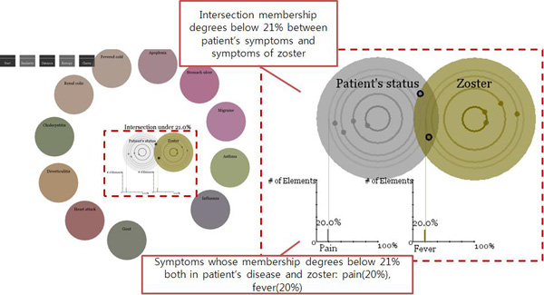

## Description

Fuzzy set refers to the dataset which does not have separate, distinct clusters, and they contain data elements whose membership degrees are between 0.0 and 1.0. Many fuzzy sets exist in the real world, and one of the important issues is to make a decision from the fuzzy sets using visual analytics tools by extracting information in the dataset intuitively. To analyze the element data in fuzzy sets, the visualization of fuzzy sets needs to show an overview of the data with membership degree and the relationship among the sets.

In our research, we suggest an interactive visualization technique of fuzzy set operations, called Disk Diagram, which offers distribution of fuzzy data, and two scenarios to allow users to interpret inter-dependency among fuzzy sets. A Disk Diagram enables to depict complexity of fuzzy sets by showing the degree of resemblance between the sets with the layout of star coordinates. This study discovered the use of a Disk Diagram with two different datasets such as fuzzy disease set and terror related words set. Lastly, the results of heuristic evaluation show that our technique supports visual perception, usability, and knowledge discovery process in the areas of visual representation and interaction.

### Use of a Disk Diagram with a fuzzy disease set

Figure 1 represents the relation between a patient's status and prototype diseases. As the degree of similarity gets higher, the distance between a patient's disk and disks of other diseases get closer. We can see that zoster is the most similar (=0.58064514) with the patient's status.

To examine the relationship of fuzzy diseases by fuzzy intersection operation, we can bring one of the disease disk (e.g., 'zoster' disk) to the 'patient's status' disk by dragging to overlap each other. With a 21% overlap between the two disks, the two disks represent the degrees of symptoms as below 21% in the intersection as shown in Figure 2 by Scenario 1. Figure 2 shows the two symptoms such as fever whose membership degree is 20% in the patient's status, and pain whose membership degree is 20% in case of zoster. The degrees of these two symptoms are comparatively low in both the patient's status and the case of zoster. In Scenario 2, if these disks are overlapped by 50% like in Figure 3, it is found that the membership degree of 'nausea' of zoster is 80%, so that 'nausea' of zoster is the most influential toward the patient's disease.

Figure 4 shows the fuzzy union operation between a 'zoster' disk and 'patient's status' disk, and all symptoms in both the patient's status and zoster are fever, distress, lesion, nausea, and pain. Among the union results, patient's status shows symptoms such as fever (40%), lesion (60%) and nausea (80%) at most, while zoster has symptoms such as distress (50%), pain (80%) and nausea (80%) at most.

> 
> Figure 1. Visualization of similarity between patient’s status and prototype diseases

> 
> Figure 2. Intersection membership degrees below 21% between patient’s status and zoster in scenario 1

> 
> Figure 3. Intersection membership degrees over 50% between patient’s status and zoster in scenario 2

> 
> Figure 4. Union of patient’s status and zoster

## Contact

Yeseul Park (ystopia at kaist.ac.kr)

## Publications

- Yeseul Park, Jinah Park, "Disk diagram: An interactive visualization technique of fuzzy set operations for the analysis of fuzzy data," Information Visualization, Vol. 9, No. 3, pp. 220-232, September 2010.
- Yeseul Park, Jinah Park, "Interactive visualization of fuzzy set operations," Proc. SPIE (Visualization and Data Analysis 2010), Vol. 7530, pp. 753002:1-753002:12, January 2010.
- Yeseul Park, Jinah Park, "Visualizing Fuzzy Set Based on Venn Diagram (벤 다이어그램 기반 퍼지 집합 시각화)," HCI Korea 2009, pp. 15-20, February 2009.