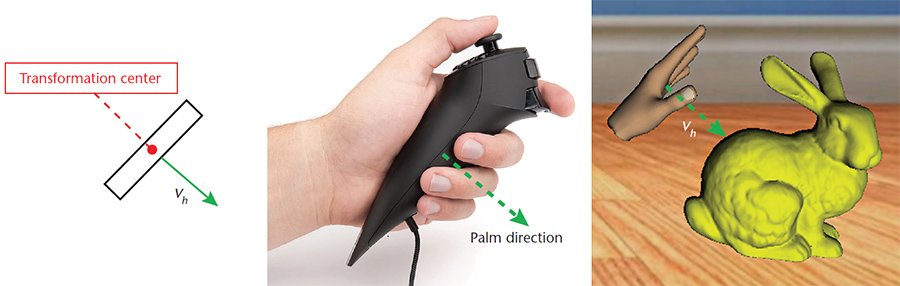
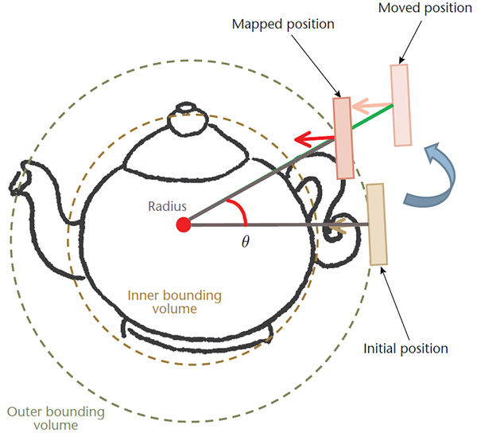
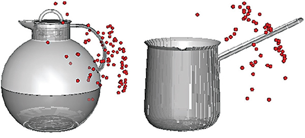

## Description

Virtual Handle with a Grabbing Metaphor (VHGM) is an interaction technique that helps users manipulate 3D objects intuitively. We employ a grabbing metaphor to provide the mapping protocol for finding the desired reference frame. We project the user’s hand into the virtual environment; a virtual-handle avatar provides useful feedback. According to the user’s input, VHGM generates a temporary reference frame for the target object so that the user controls the operation. The user can manipulate the object naturally, perceiving the transformation as if he or she had actually grabbed the object. Because VHGM focuses on the user’s hand, not a particular device, it’s suitable for many 3D input devices.

> 

> 

> 

> 

> 

## Contact

Taeho Kim (kdhtheo at kaist.ac.kr)

## Publications

- Taeho Kim, Jinah Park, "3D interaction methods for medical applications: from the concept to the evaluation," HCI Korea 2015 Doctoral Consortium, December 2014.
- Taeho Kim, Jinah Park, "3D Object Manipulation Using Virtual Handles with a Grabbing Metaphor," IEEE Computer Graphics and Applications, Vol. 34, No. 3, pp. 30-38, May 2014.
- Taeho Kim, Jinah Park, "An Interface for Object Assembly in 3D Virtual Environment using Two Hands Mid-air Interaction (3차원 가상 환경에서의 객체 조립을 위한 양손 공간 인터랙션 기반 인터페이스)," HCI Korea 2014, pp. 1069-1072, February 2014.
- Taeho Kim, Jinah Park, "Virtual Handle with Grabbing Metaphor (직관적인 3차원 객체 조작을 위한 쥠 메타포를 이용한 가상핸들)," Program Registration (No. C-2013-003409), Korea Copyright Commission, February 2013.