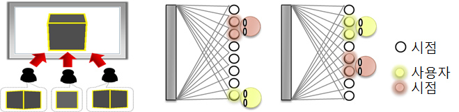
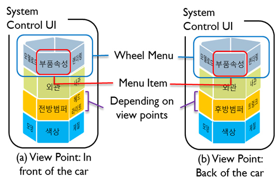
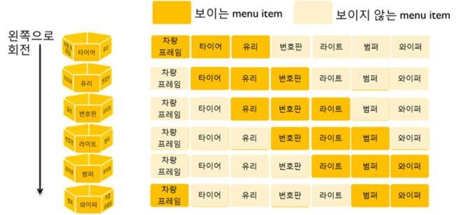
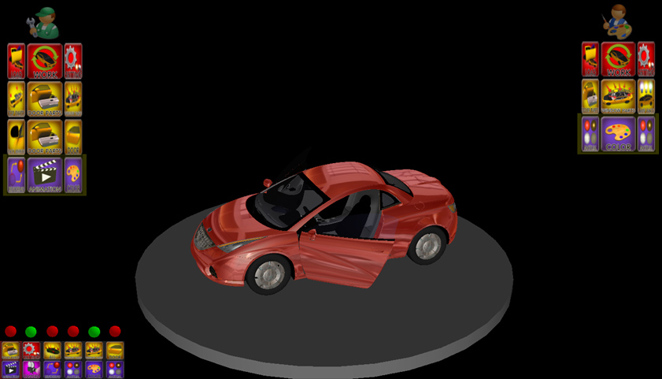

## Description

We propose “System Control UI” and “Task History UI” as graphic user interface in multi-view and multi-user collaborative environment. People do not focus on the GUI on multi-view display which shows same scene but offers different views depending on the user’s position. The multi-view and multi-user collaborative work requires UI that consider diverse information of contents according to the user’s view point. In this paper, we focus on this issue, the menu system UI for the multi-view and multi-user collaborative work. The proposed menu system offers the System Control UI for an individual user. It considers each user’s view point and handles individual information. Also, the menu system offers the Task History UI to display who controls the system and which task is occurred.

> 
> Concept of multi-user and multi-view system

> 
> System Control UI: Wheel menu contains the menu items depending on view points.

> 
> Components of wheel menu

> 
> Application of proposed UI to automotive design

## Contact

Mihee Jo (algldl at kaist.ac.kr)

## Publications

- Mihee Jo, Jaeil Kim, Yeseul Park, Jinah Park, "3D GUI for Collaboration of Multi-users and Multi-view (다 시점, 다중 사용자의 협업을 위한 3D GUI)," HCI Korea 2011, pp. 795-797, January 2011.