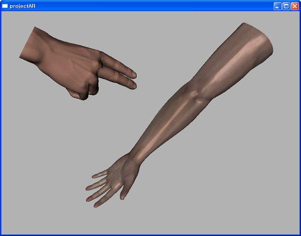

## Description

High proficiency and safety of medical operations decreases a treatment period and prevents a recurrence of an illness. Because of it, there are many researches to increase proficiency and safety of medical operations. Especially, by the development of high technology, researchers start to focus on medical simulators which provide a medical experience and a scenario in the virtual world.

An intravenous injection simulator is one of these medical simulators. Because an intravenous injection highly depends on the proficiency of a medical operator, the intravenous injection simulator is becoming important. For increasing the reality of the intravenous injection simulator, we provide not only visual feedback but also haptic feedback. From the visual feedback, the user can see an arm, a syringe, and a vein which is inside of the arm and will be injected from the syringe. From the haptic feedback, the user can receive the force when the syringe and the arm are collided.

In our intravenous injections simulator, following components are included:

- Layered deformation algorithm of an arm with its anatomical structure
- Fast local deformation algorithm
- Real time collision detection algorithm
- Haptic rendering

> 

> 

> 

> 

## Contact

Seok Kim (gstone0103 at kaist.ac.kr)

## Publications

- Seok Kim, Jinah Park, "Feeling the Vein for Intravenous Injection Preparation," The 2nd Eurographics Workshop on Visual Computing for Biology and Medicine (VCBM 2010), Poster, July 2010.
- Seok Kim, Jihwan Park, Jinah Park, "Haptic Rendering Based on Penetration Depth for Intravenous Injection Simulation (정맥 주사 시뮬레이션을 위한 깊이 기반 햅틱 렌더링)," The 3rd KHC Workshop (제3회 햅틱스 연구회 워크샵), February 2010.