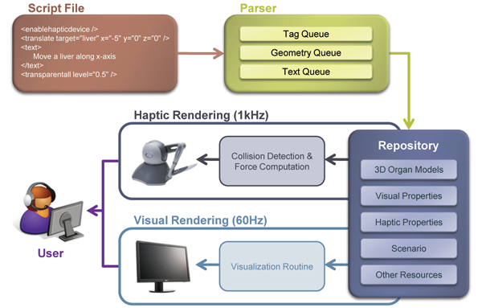
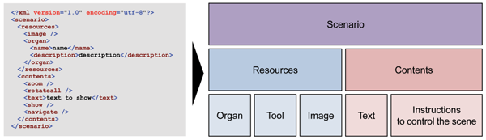
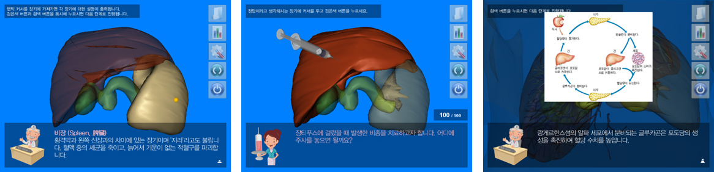

## Description

Haptic interaction has become an essential component in constructing immersive virtual environment, and now plenty of virtual education platforms introduce the haptics in their system. Researchers have revealed that haptic interaction can improve learners' understanding. However, the contents with haptic interaction are relatively hard to produce due to the complexity of development procedures.

To address this problem, we developed the interactive human anatomy learning platform. The distinguishable feature of our platform is the user-creatable multimodal learning scenario. The script containing the learning scenario is written in XML format. Since it provides intuitive grammar, the user without any prior knowledge of haptics or even programming languages can produce his or her own scenarios. The script engine interprets the script file, and haptic and visual rendering loops deliver the contents in the script to the user via corresponding modalities. The multimodal interactions between the system and the user then increase the presence and the immersion. We expect our platform to promote many haptic-based applications in learning environment, especially for young children to learn about the human body structures more effectively.

> 

> 

> 

## Contact

Seokyeol Kim (sy.kim at kaist.ac.kr)

## Publications

- Seokyeol Kim, Jinah Park, "Designing a Framework of Multimodal Contents Creation and Playback System for Immersive Textbook (실감형 교과서를 위한 멀티모달 콘텐츠 저작 및 재생 프레임워크 설계)," Journal of the Korea Contents Association, Vol. 10, No. 8, pp. 1-10, August 2010.
- Seokyeol Kim, Jinah Park, "HaptiBody Navigator - XML-based Multimodal Contents Playback System for Human Anatomy Study (HaptiBody Navigator - XML 기반의 인체 학습용 멀티모달 컨텐츠 재생 시스템)," HCI Korea 2010, pp. 209-211, January 2010.
- Seokyeol Kim, Jinah Park, "HaptiBody Navigator - Interactive Human Body Learning Platform with Haptic Interaction," The 12th Korea-Germany Joint Workshop on Advanced Medical Image Processing, pp. 106-110, September 2009.
- Seokyeol Kim, Jinah Park, "HaptiBody Navigator v1.0," Program Registration (Reg. No. 2009-01-133-004913), Korea Copyright Commission, September 2009.
- Seokyeol Kim, Kimin Kim, Jaeil Kim, Jinah Park, "Immersive Human Body Learning System using Visible Korean Human Dataset (Visible Korean Human Dataset을 활용한 인체 구조 학습 시스템)," 2009 KSIIM Joint Workshop (의학영상정보 분야 공동학술대회), May 2009.
- Kimin Kim, Jaeil Kim, Seokyeol Kim, Jinah Park, "Virtual Science Lab - Sensible Human Body Learning System (가상 과학 실험실 - 체감형 인체 구조 학습 시스템)," HCI Korea 2009, pp. 2078-2079, February 2009.
- Kimin Kim, Jaeil Kim, Jinah Park, "Human body learning system using multi-modal and user-centric interfaces (멀티모달 사용자 중심 인터페이스를 적용한 인체 학습 시스템)," HCI Korea 2008, pp. 85-90, January 2008.