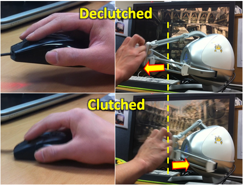
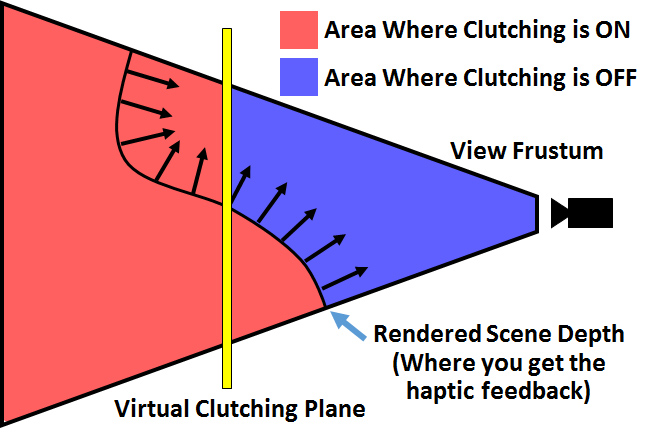
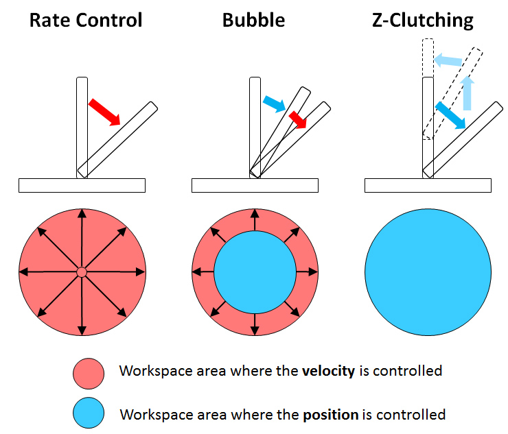
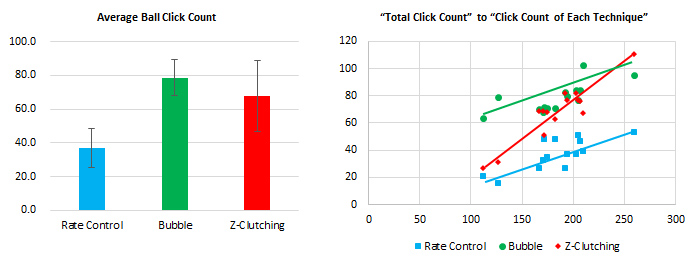

## Description

Navigating a large 3D virtual environment using a generic haptic device can be challenging since the haptic device is usually bounded by its own physical workspace. On the other hand, mouse interaction easily handles the situation with a clutching mechanism - simply lifting the mouse and repositioning its position in the physical space. Since the haptic device is used for both input and output at the same time, it is often the case to limit its freedom to accommodate such situation. In this research, we propose a new mechanism called Z-Clutching for 3D navigation of virtual environment by using only the haptic device without any interruption nor sacrifice in the given degrees of freedom of the device's handle. We define the clutching state which is set by pulling the haptic handle back into space. It acts like lifting the mouse off the desk. In this way, the user naturally feels the haptic feedback based on the depth (z-direction) while manipulating the haptic device, and moves the view as he desires at the same time. We conducted a user study to evaluate the proposed interaction technique, and the results are promising in its usefulness.

> 
> Basic concept of Z-Clutching interaction

> 
> Detailed diagram of clutching state criteria in depth-based haptic rendering environment

> 
> Three interaction techniques compared for evaluation

> 
> (Left) Average ball click count with the standard deviation range for all subjects. (Right) Distributed plot of “total click count” vs. “click count from each interaction technique”.

## Contact

Deok-Jae Song (djsong at kaist.ac.kr)

## Publications

- Deok-Jae Song, Seokyeol Kim, Jinah Park, "Z-Clutching: Interaction Technique for Navigating 3D Virtual Environment Using a Generic Haptic Device," Journal of Computing Science and Engineering, Vol. 10, No. 1, pp. 32-36, March 2016.