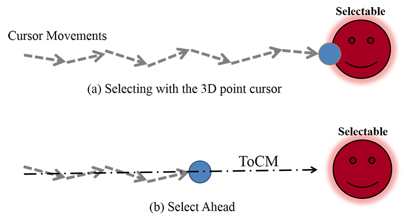
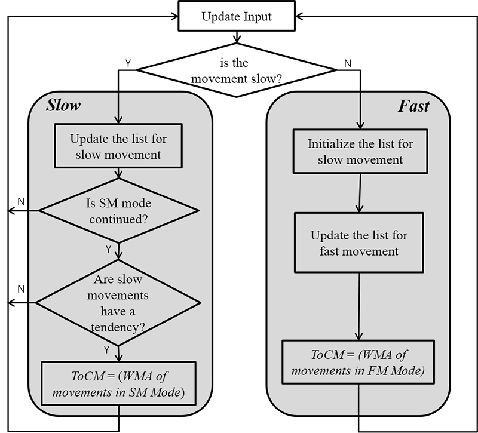
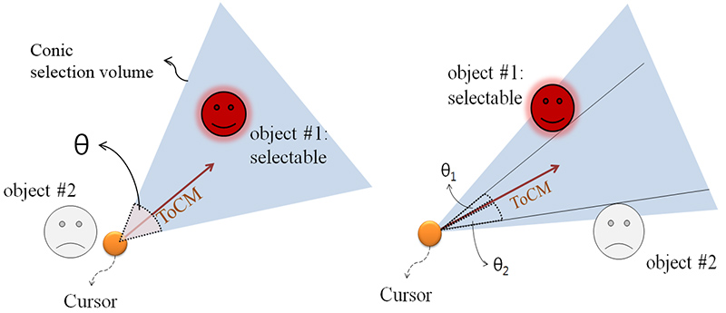
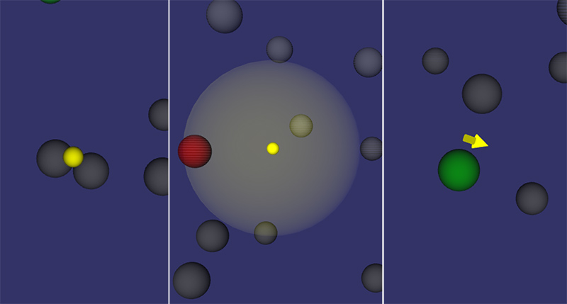

## Description

Among the applications of virtual hand, simple virtual hand metaphor has one-to-one mapping between the 3D cursor and the physical input. Although its one-to-one mapping nature provides the very intuitive manipulation interface, it requires lengthy movement of the cursor for object selection task. This long trace of cursor directly reflects the level of fatigue of the user in performing object selection. In this research, we propose Select Ahead as a new object selection technique that overcomes the limitation while maintaining the intuitiveness of simple virtual hand. Select Ahead guides the user to select the distant object along the estimated tendency based on the previous cursor movements. We evaluate the relative performance of Select Ahead through the experiments in 3D virtual environments with various object densities. The results show that Select Ahead reduces the length of the cursor trace remarkably compared to those of the 3D point cursor and the 3D bubble cursor regardless of the object density. For the selection time, Select Ahead outperforms the 3D point cursor and has no significant difference compared to that of the 3D bubble cursor.

> 
> While the 3D point cursor requires the contact between the target object and the cursor, Select Ahead can select the distant target object located along estimated ToCM from the cursor.

> 
> Flow chart of update algorithm for ToCM by the velocity of the cursor movements

> 
> The object #1 is selectable because the object #1 located in selection volume (left). When the multiple objects are included in selection volume, the object #1 is selectable because the object #1 is minimum angular difference (θ1<θ2) among the objects located in selection volume (right).

> 
> Visualization of 3D point cursor (left), 3D bubble cursor (middle), and Select Ahead (right)

## Contact

Soonchan Park (mrsnake at kaist.ac.kr)

## Publications

- Soonchan Park, Seokyeol Kim, Jinah Park, "Select Ahead: Efficient Object Selection Technique Using the Tendency of Recent Cursor Movements," APCHI 2012, pp. 51-58, August 2012.
- Soonchan Park, Seokyeol Kim, Jinah Park, "A Comparison Study on 3D Object Selection Techniques of Virtual Hand Metaphor (가상 손 환경 기반 3차원 객체 선택 기법 비교분석 연구)," KCGS 2012 (한국컴퓨터그래픽스학회 2012 학술대회), pp. 105-106, June 2012.
- Soonchan Park, Jaeil Kim, Jinah Park, "Select Ahead : Interaction Technique to Improve Efficiency of Object Selection in Virtual Environment with 3D Cursor (Select Ahead : 3D 커서를 사용한 가상환경에서 객체 선택의 효율성 향상을 위한 상호작용 기법)," HCI Korea 2012, pp. 6-8, January 2012.
- Soonchan Park, Jaeil Kim, Jinah Park, "A Method for Providing Visual Contact Cue to Improve Efficiency of 3D Cursor-based Selection in Virtual Environment (가상환경에서 차원 커서 기반 3D 객체 선택의 효율성 향상을 위한 Visual Contact Cue 제공 방법)," HCI Korea 2011, pp. 147-149, January 2011.
