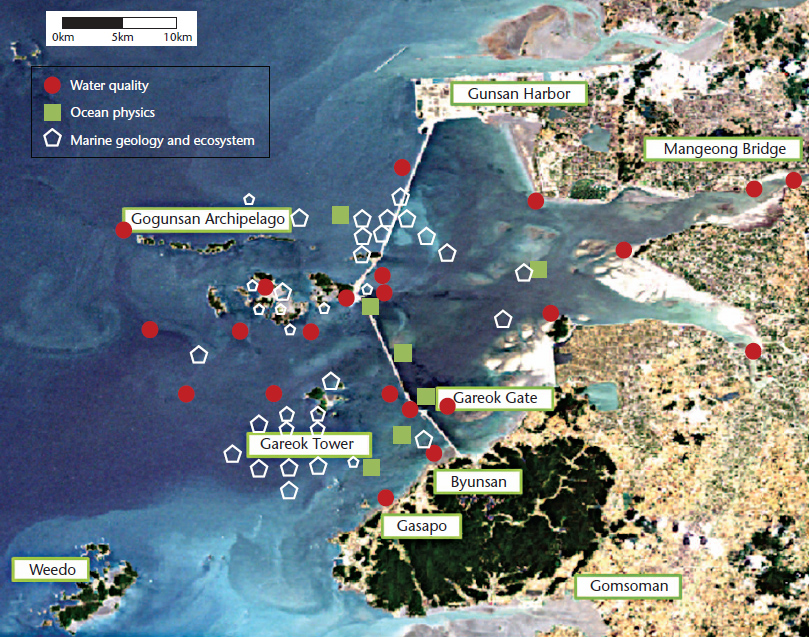
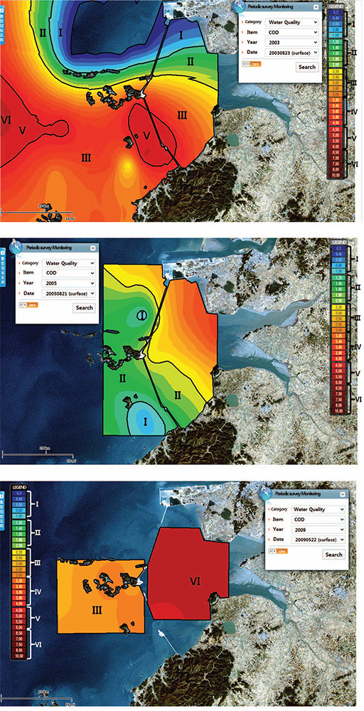

## Description

Marine environmental datasets are obtained from observations and simulations and are diverse, complex, and heterogeneous. However, oceanographers often settle for mere statistics displayed in 2D time-series graphs or fragmentary figures. Such piecemeal analysis of oceanic processes and marine phenomena can’t capture the ocean’s complex dynamics and relationships.

Instead, we need dimensionally advanced statistical and scientific visual analysis of long-term accumulated data. The first challenge for such analysis is handling the data, owing to their enormous size and varied formats. The next challenge is fusing the information for knowledge discovery. Finally, developing effective visualizations that tap into humans’ visual-reasoning ability is key to successful analysis.

Thus we’ve developed a visual analytics (VA) tool with an embedded GIS (geographic information system) for location-based oceanographic data. We find that it’s intuitive to employ geographic grids that integrate marine environmental data, geographic information, and multidimensional spatiotemporal distribution.

> 

> 

> 

## Contact

Jinah Kim (kimjinah at kaist.ac.kr)

## Publications

- Jinah Kim, Jinah Park, "Bayesian structural equation modeling for coastal management: The case of the Saemangeum coast of Korea for water quality improvements," Ocean & Coastal Management, Vol. 136, pp. 120-132, February 2017.
- Jinah Kim, Jinah Park, "Mathematical modeling of coastal marine environments using observational data for coastal management," Ocean & Coastal Management, Vol. 116, pp. 396-403, November 2015.
- Jinah Kim, Jinah Park, "A statistical model for computing causal relationships to assess changes in a marine environment," Journal of Coastal Research, Special Issue 65 - International Coastal Symposium Volume 1, pp. 980-985, January 2013.
- Jinah Kim, Jinah Park, "Visualizing Marine Environmental Changes to the Saemangeum Coast," IEEE Computer Graphics and Applications, Vol. 32, No. 6, pp. 82-87, November/December 2012.
- Jinah Kim, Kwangsoon Park, Jaeil Kwon, Jinah Park, "Web-based Information System for Ocean / Coastal Environmental Data Service (해양환경자료의 서비스를 위한 웹 기반 정보시스템)," Journal of KIISE: Computing Practices and Letters (정보과학회논문지: 컴퓨팅의 실제 및 레터), Vol. 17, No. 12, pp. 630-639, December 2011.
- Jinah Kim, Chang S. Kim, Jinah Park, "Web-GIS based Saemangeum Coastal Information System," 10th International Symposium on GIS and Computer Mapping for Coastal Zone Management (CoastGIS 2011), Vol. 4, pp. 138-145, September 2011.
- Jinah Kim, Jaeil Kwon, K.S. Park, Jinah Park, "Implementation of Korea Operational Oceanographic Information System using Web-GIS," 10th International Symposium on GIS and Computer Mapping for Coastal Zone Management (CoastGIS 2011), Vol. 3, pp. 102-109, September 2011.
- Jinah Kim, Changsik Kim, Jinah Park, "Implementation of Saemangeum Coastal Environmental Information System Using GIS (지리정보시스템을 이용한 새만금 해양환경정보시스템 구축)," Journal of the Korean Association of Geographic Information Studies, Vol. 14, No. 4, pp. 128-136, December 2011.
- Jinah Kim, Jinah Park, KS Park, Jaeil Kwon, "Development of a Web Service based GIS-enabled Storm-surge Visualization System (웹 서비스 기반 GIS 연동 폭풍ㆍ해일 시각화 시스템 개발)," Journal of KIISE: Computing Practices and Letters (정보과학회논문지: 컴퓨팅의 실제 및 레터), Vol. 14, No. 9, pp. 841-849, December 2008.
- Jinah Kim, K.S. Park, J. Kwon, Jinah Park, "Geo-Visualization of Storm-Surge Study based on Web-GIS (Web-GIS 기반 폭풍해일 시각화 기법 연구)," KCC 2008, pp. 246-249 June 2008.