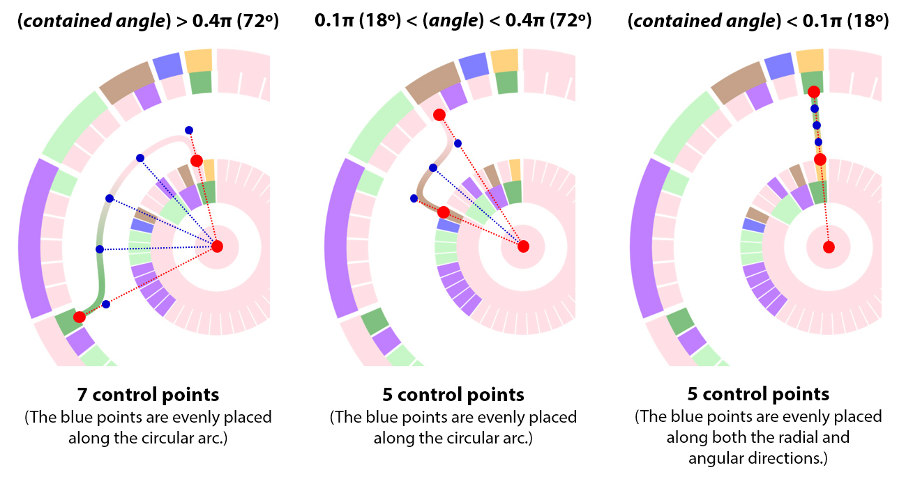
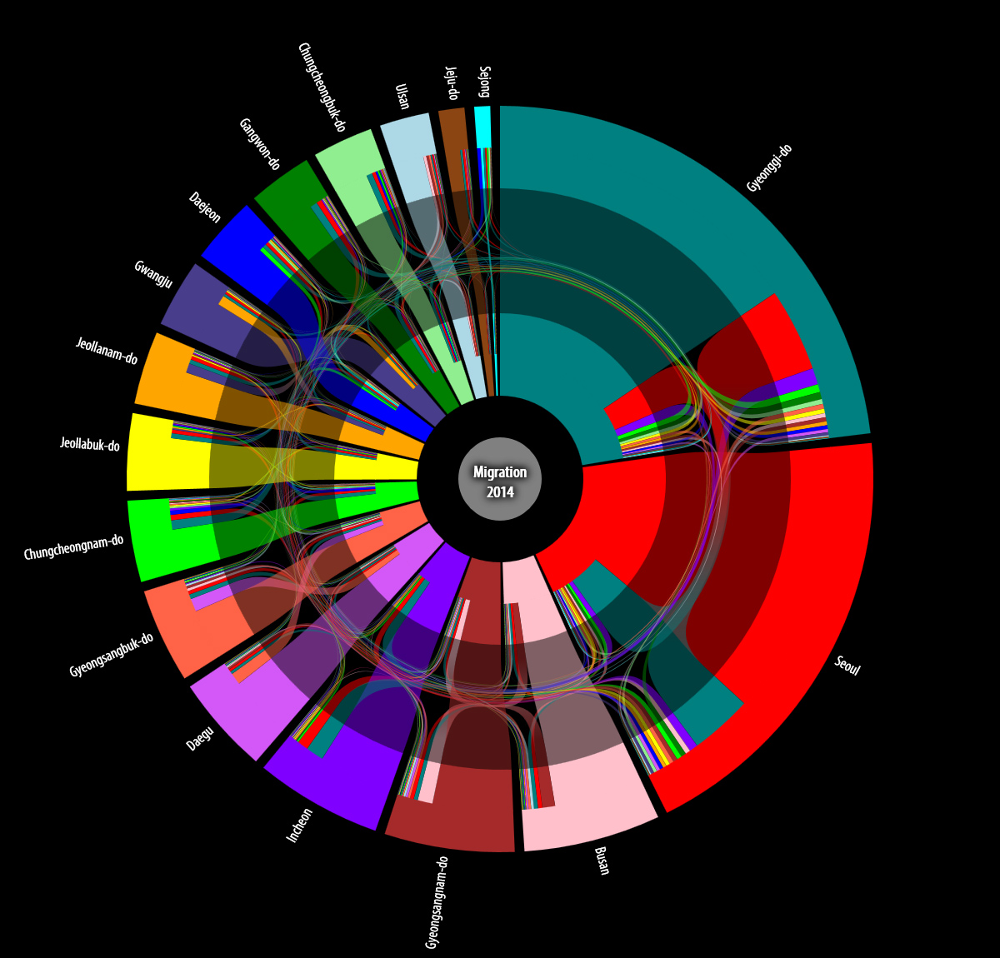
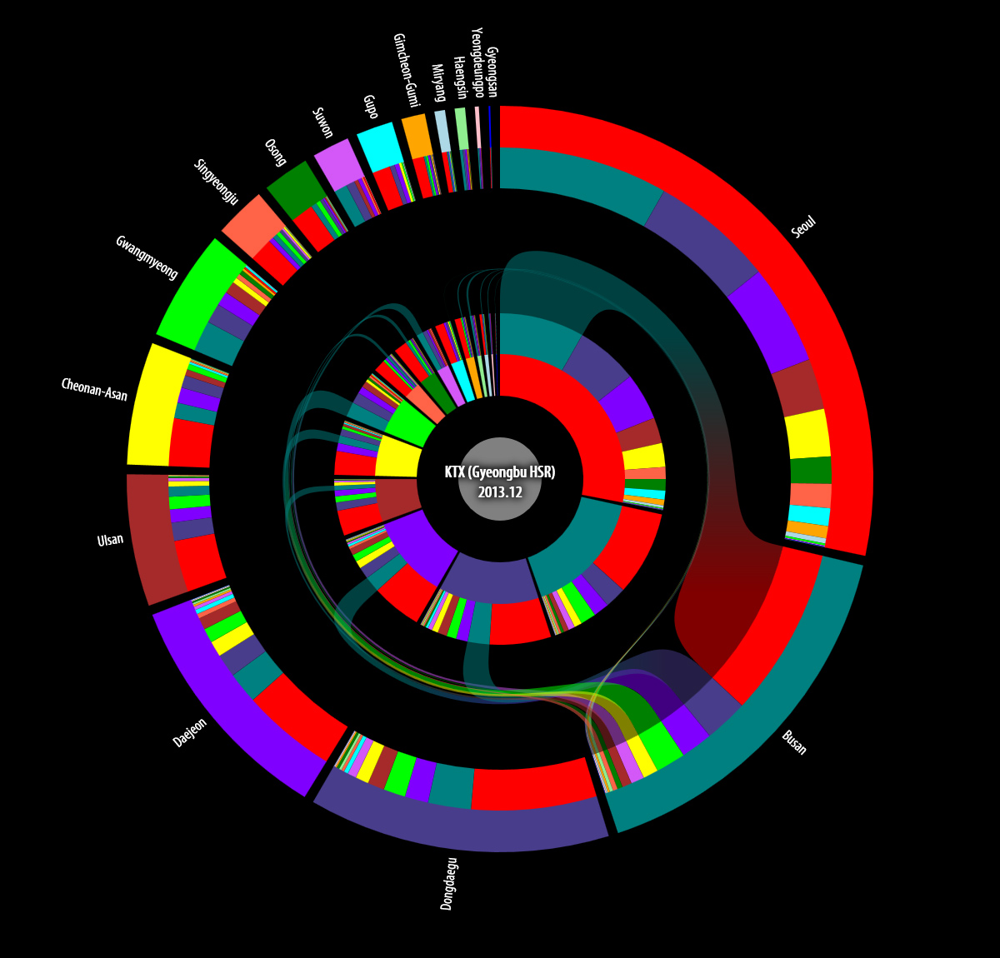

## Description

OD (origin-destination) data represent the movement of people or goods between geographical points, and play important roles in establishing policies for migration and transportation. However, since most of raw OD data are very massive and written in unintuitive form, it is difficult to grasp meaningful information from the data themselves especially without visual aids. We propose an effective visualization method for the OD data by combining the key features of Radial Table and Parallel Sets. Radial Table is an intuitive and aesthetically attractive data visualization technique based on a circular layout, but it is unfit to visualize the OD data due to its single-layered structure. To overcome its limitation, we refer to the visual structure of Parallel Sets and divide the original Radial Table into multiple concentric layers which contain origins and destinations separately. Each pair of the origin and destination is connected by a B-spline curve, and it indicates a direction and a scale of the flow. Also we validate the proposed method by implementing and applying to real-world datasets. In this way, our method will help an analyst understand the pattern and volume of traffic at a glance, and support a decision making process.

> 
> Path drawing based on a B-spline curve

> 
> Visualization result for OD flows
> (source: internal migration in South Korea (2014))

> 
> Emphasizing specific flows
> (source: monthly ridership of KTX (December 2013))

> 
> Comparision between sparse and dense data
> (source: daily ridership of public bicycles in Daejeon (December 2014))

## Contact

Seokyeol Kim (sy.kim at kaist.ac.kr)

## Publications

- Seokyeol Kim, Youngju Oh, Jinah Park. "Multi-layered Radial Table for Visualizing Origin-Destination Data (OD 데이터 시각화를 위한 다중 계층 래디얼 테이블)." HCI Korea 2016, pp. 377-381, January 2016.