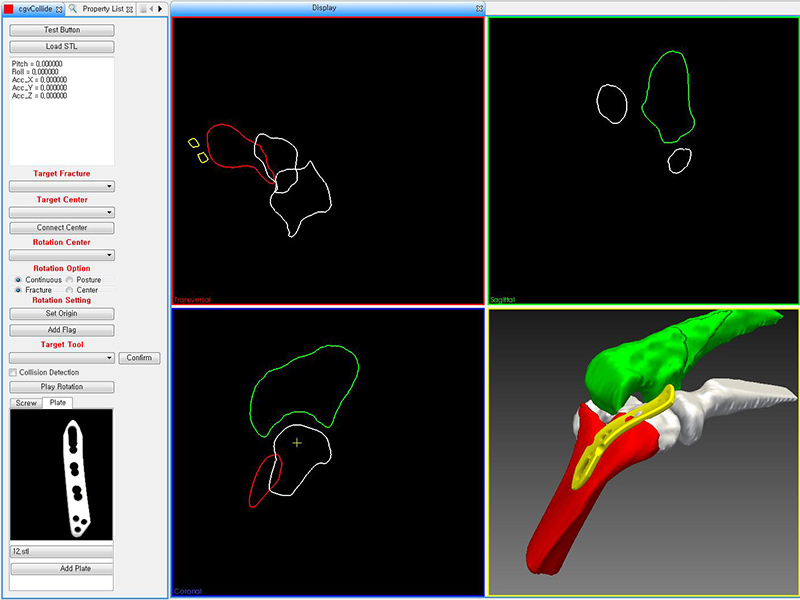
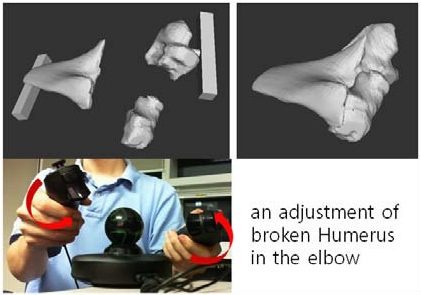
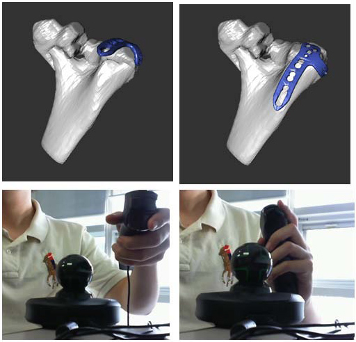
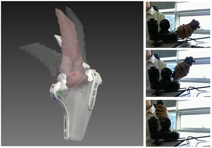

## Description

Intra-articular fractures, caused by high impact injuries on joints, can affect movement functionality, if not treated properly. Due to the complexity of bone shape and the 3D nature of the surgical operations, there is a potential danger of the failure in the anatomical reduction caused by misplacement or wrong selection of plates or screws. In this paper, we propose an elaborative 3D surgical planning system to analyze reciprocal action of bones with surgical implants applied before intra-articular fracture surgery. The simulation software provides the environment that can simulate rigid transformation of aligned broken bones with surgical implants according to specified degrees of freedom (DOF) of movement. In addition, our software visualizes possible collision among the bones and fixation components during transforming process. We demonstrate how the collision detection and DOF restriction can be utilized for constructing more adequate orthopedic surgery plan.

> 

> 

> 

> 

## Contact

Taeho Kim (kdhtheo at kaist.ac.kr)

## Publications

- Taeho Kim, Jinah Park, "An Intuitive Interaction Method for Handling Intra-articular Bone Structures in 3D Space for Fracture Surgery Planning," International Forum on Medical Imaging in Asia (IFMIA) 2012, November 2012.
- Taeho Kim, Jaeil Kim, Jinah Park, "Orthopedic Surgery Planning Simulator for Intra-articular Fracture," The 8th International Conference of ISSiS (International Society for Simulation Surgery), pp. 90, June 2012.