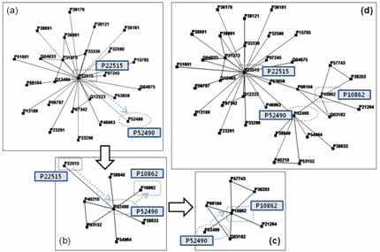

## Description

Evolution of computer technologies makes it possible to access a large amount and various kinds of biological data via internet such as DNA sequences, proteomics data and information discovered about them. It is expected that the combination of various data could help researchers find further knowledge about them. Roles of a visualization system are to invoke human abilities to integrate information and to recognize certain patterns in the data. Thus, when the various kinds of data are examined and analyzed manually, an effective visualization system is an essential part. One instance of these integrated visualizations can be combination of protein-protein interaction (PPI) data and Gene Ontology (GO) which could help enhance the analysis of PPI network. We introduce a simple but comprehensive visualization system that integrates GO and PPI data where GO and PPI graphs are visualized side-by-side and supports quick reference functions between them. Furthermore, the proposed system provides several interactive visualization methods for efficiently analyzing the PPI network and GO directed-acyclic-graph such as context-based browsing and common ancestors finding.

> 

> 

> 

> 

## Contact

Yunkyu Choi (ckyun777 at kaist.ac.kr)

## Publications

- Yunkyu Choi, Seok Kim, Gwansu Yi, Jinah Park, "Protein Interaction Network Visualization System Combined with Gene Ontology (유전자 온톨로지와 연계한 단백질 상호작용 네트워크 시각화 시스템)," Journal of KIISE: Computer Systems and Theory (정보과학회논문지: 시스템 및 이론), Vol. 36, No. 2, pp. 60-67, April 2009.
- Yunkyu Choi, Seok Kim, Gwansu Yi, Jinah Park, "PINGO v1.0," Program Registration (Reg. No.: 2009-01-129-000926), Korea Software Copyright Committe, February 2009.
- Yunkyu Choi, Seok Kim, Gwan-Su Yi, Jinah Park, "PINGO: Integrated Visualization System for Protein-protein Interaction Network and Gene Ontology," Korea e-Science AHM 2008, September 2008.
- Yunkyu Choi, Jinah Park, "Dynamic visualization of relational data," BIEN 2009, August 2009.
- Seok Kim, Yunkyu Choi, Gwansu Yi, Jinah Park, "Visualization and Analysis of Gene Ontology (유전자 온톨로지 가시화 및 분석 방법)," KCGS 2008, July 2008.
- Yunkyu Choi, Seok Kim, Gwansu Yi, Jinah Park, "Research on Protein Interaction Network Visualization Tool Combined with Gene Ontology (유전자 온톨로지와 연계한 단백질 상호작용 네트워크 시각화 시스템에 관한 연구)," KCC 2008, June 2008.