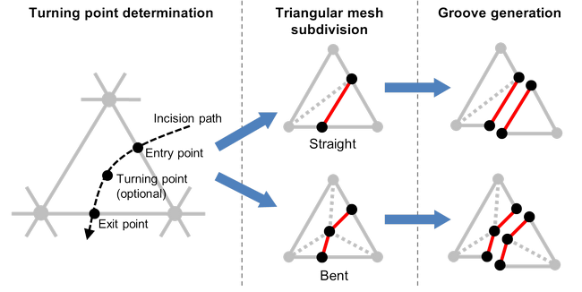
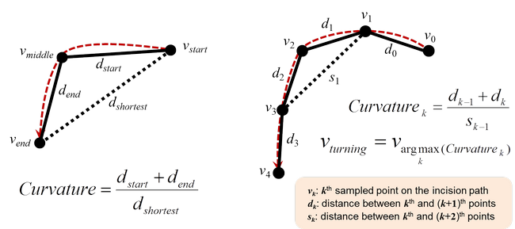
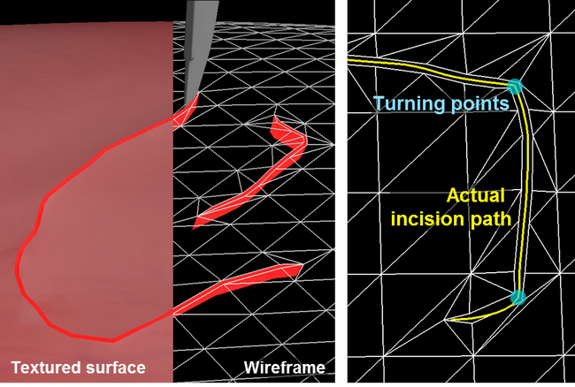
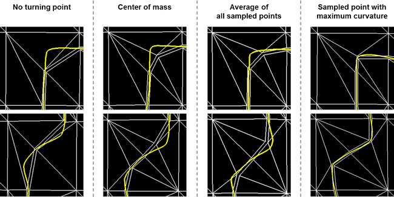

## Description

Incision is one of the most critical actions in the medical treatment, and the constant practice is required to be skillful at it. Accordingly, researchers have strived to simulate the incision in the virtual environment. Recently, several methods for mesh cutting and deformation are presented to establish a realistic incision simulator. However, most of previous methods endure the alternative of inaccurate incision path or redundant primitives for their primary goal. These factors often affect the results of further simulation steps. To address this issue, we need to find the optimal trade-off between the accuracy and the complexity of the geometry in an acceptable time delay.

Through this research, we suggest a method for real-time mesh cutting while minimizing the unnecessary subdivisions. For faithful reflection of user's motion with a limited number of triangles, a turning point determination algorithm based on local curvature is applied to our system. In addition, we provide a quantitative incision skill assessment method based on the Fréchet distance.

> 
> Procedures of triangle subdivision on a case-by-case basis

> 
> Definition of curvature in proposed system

> 
> Subdivided triangles and groove generated along incision path

> 
> Comparison with other turning point determination methods

## Contact

Seokyeol Kim (sy.kim at kaist.ac.kr)

## Publications

- Seokyeol Kim, Jinah Park, "Quantitative Incision Skill Assessment for Computer-based Surgery Simulator (컴퓨터 기반 수술 훈련 시뮬레이터를 위한 정량적 절개 숙련도 평가 기법)," KCC 2011, Vol. 38, No. 1(B), pp. 282-285, June 2011.
- Seokyeol Kim, Jinah Park, "Virtual Incision Evaluator v1.0," Program Registration (No. 2011-01-133-004007), Korea Copyright Commission, June 2011.
- Seokyeol Kim, Jiwhan Park, Jinah Park, "Progressive Mesh Cutting for Real-time Haptic Incision Simulator," ACM SIGGRAPH Asia 2010 Posters, December 2010.
- Seokyeol Kim, Jinah Park, "Virtual Incision Trainer v1.0," Program Registration (No. 2010-01-133-006415), Korea Copyright Commission, November 2010.
- Seokyeol Kim, Jinah Park, "Progressive Subdivision Scheme for Virtual Incision Training," The 13th Germany-Korea Joint Workshop on Advanced Medical Image Processing, pp. 35-36, September 2010.