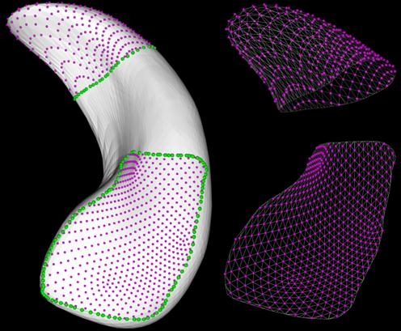
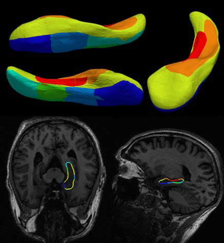
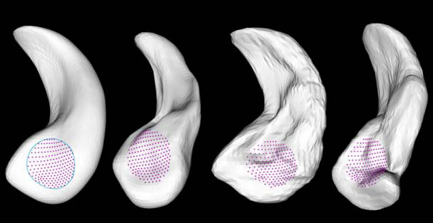

## Description

Recently, medical applications for quantitative measurement use 3D organ models, owing much to their adaptability to representing the natural shape and size of human organs, and their capability of assessing the quantitative variations on interested regions. Specifying several anatomical regions in a single organ model helps to understand the regional variations in shape and volume, for instance, assessing the correlation between shapes changes of anatomical regions and clinical conditions. To determine anatomical regions in a 3D organ model, a manual region-annotation method is called for, because regions have to be specified manually by users with their anatomical knowledge. Therefore, we introduce an interactive region-annotation method for specifying and manually annotating anatomical regions on surface models of human organs. Our method consists of two parts (1) to specify and annotate interactively the interest anatomical region, independently of the structure of surface models and (2) to confirm the determined region by displaying the annotated information in 2D medical image planes.

> 

> 

> 

## Contact

Hojin Ryoo (ryoo.hojin at kaist.ac.kr)

## Publications

- Hojin Ryoo, Jaeil Kim, Jinah Park, "An Interactive Region-Annotation Method for Specifying and Assessing Anatomical Regions on 3D Human Organ Models," International Forum on Medical Imaging in Asia (IFMIA) 2012, November 2012.