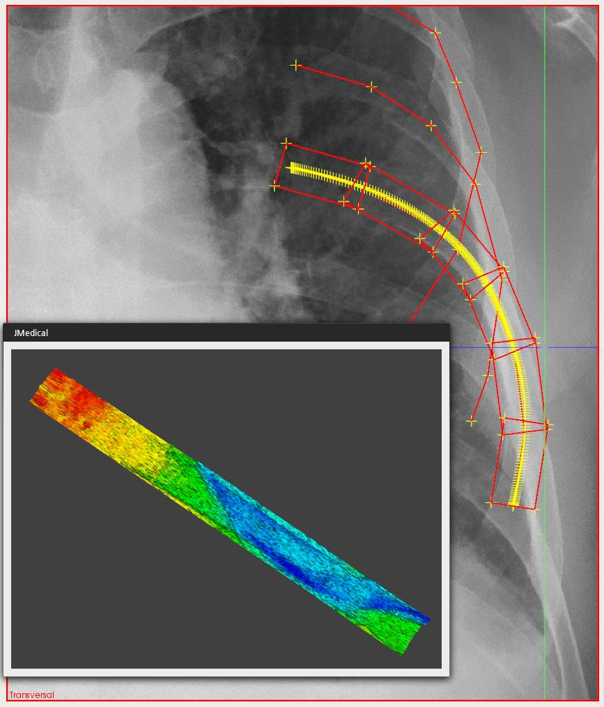
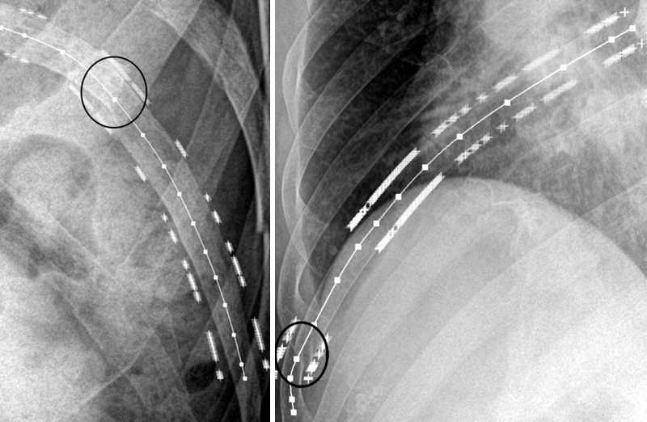

## Description

The detection of rib fractures is utmost important to detect associated injury, to prevent complication, to obviate medicolegal issues, to detect pathologic fractures, and to help manage patient’s pain. The plain radiography is the most commonly used imaging tool to detect rib fractures, because of its economic and clinical benefits. However, the accuracy for detecting rib fractures in chest radiographs depends on the observer’s training level, the quality of displayed images and the clinical scenario for which chest radiographs were obtained. To improve the accuracy of rib fracture detection and to reduce the diagnostic time, we propose a computer-assisted rib fracture detection method. Our method consists of three functional steps; (a) the contrast enhancement for ribs on chest radiographs, (b) “fractureness” measurement using spline-based rib representation, and (c) rib fracture classification using learning methods. Through these steps, the suspicious regions on plain radiographs, where rib fractures can be found with the higher possibility, are suggested to medical doctors.

> 

> 

## Contact

Jaeil Kim (threeyears at kaist.ac.kr)

## Publications

- Jaeil Kim, Sungjun Kim, Young Jae Kim, Kwang Gi Kim, Jinah Park, "Quantitative Measurement Method for Possible Rib Fractures in Chest Radiographs," Healthcare Informatics Research, Vol. 19, No. 3, pp. 196-204, September 2013.
- Sungjun Kim, Kwanggi Kim, Jinah Park, Jaeil Kim, Young Han Lee, Ho-Taek Song, Jin-Suck Suh, "A Quantitative Measurement Method Using Shape and Texture Features for Possible Rib Fractures in Chest Radiographs," Radiological Society of North America (RSNA) 2012 Scientific Assembly and Annual Meeting, November 2012.
- Hojin Ryoo, Jaeil Kim, Jinah Park, "Extracting Texture Features of Different Fracture Types for Improving Rib Fracture Detection (늑골 골절 검출 향상을 위한 골절 종류에 따른 텍스처 특징 추출)," KCGS 2012 (한국컴퓨터그래픽스학회 2012 학술대회), pp. 201-202, June 2012.
- Jaeil Kim, Kwang Gi Kim, Chang Bu Jeong, Jinah Park, "Quantitative measures for rib fracture detection on chest x-ray (흉부 X-Ray에서 늑골 골절 검출을 위한 정량적 측정 방법)," KSIIM Joint Workshop (의학영상정보 분야 공동학술대회) 2010, pp. 183-184, July 2010.