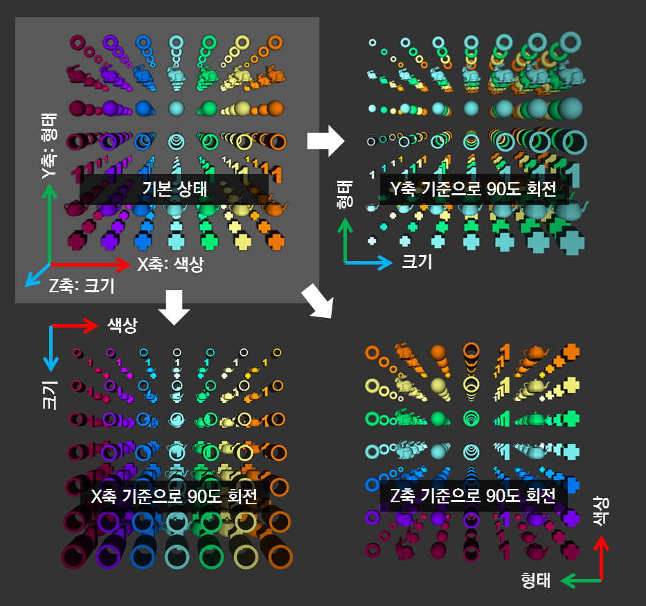
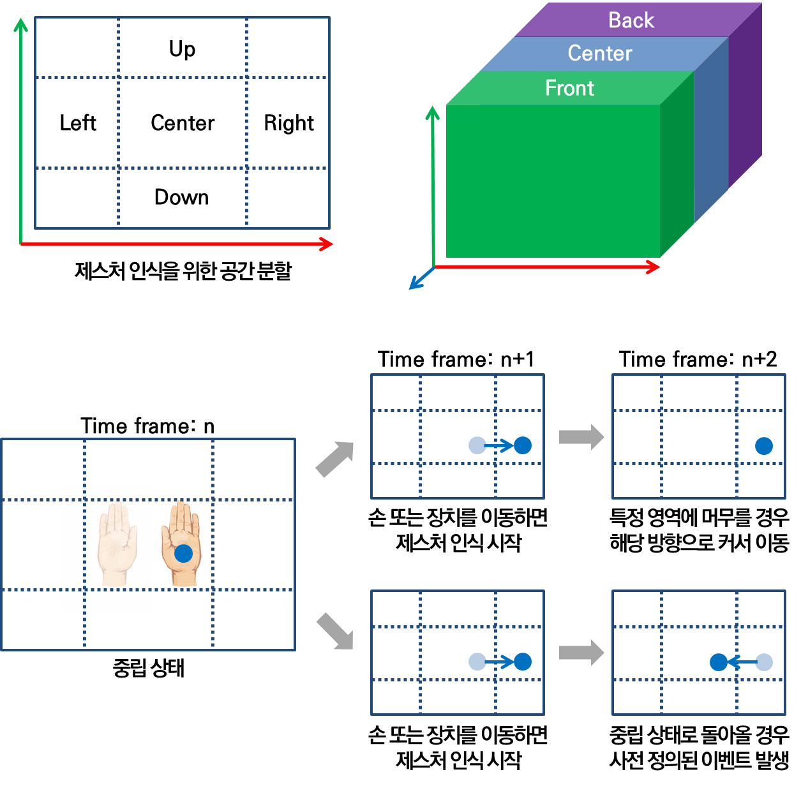
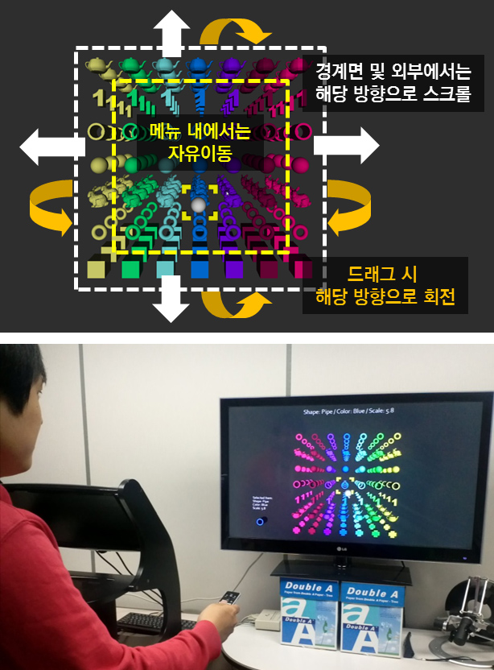

## Description

Most of digital contents and applications contain various types of itemized data, and data browsing is an essential task for these contents. However, spatial input devices which are recently adopted are unsuitable for the conventional data browsing scheme due to the nature of the spatial input. Besides, 2D user interfaces have limits to seek for the target item from the multi-dimensional and massive item collection. In this research, we suggest a cube-like 3D user interface which is suited to the multi-dimensional data browsing and compatible with the spatial input. All selectable items are arranged in the 3D space which has three axes, and each axis of the cube represents a specific property of the items. The arrangement of the items can be changed by just rotating the cube, so the user can compare and select the items in every possible combinations. This will help the user explore the target from the massive data set.

> 

> 

> 

## Contact

Seokyeol Kim (sy.kim at kaist.ac.kr)

## Publications

- Seokyeol Kim, Jinah Park, "Interface for Multi-dimensional Data Browsing (다차원 데이터 탐색을 위한 큐브형 사용자 인터페이스)," Program Registration (No. C-2013-003408), Korea Copyright Commission, February 2013.
- Seokyeol Kim, Jinah Park, "Rotatable Cubic User Interface for Multi-dimensional Data Browsing (다차원 데이터 탐색 및 선택을 위한 큐브 회전형 사용자 인터페이스)," HCI Korea 2013, pp. 350-352, January 2013.