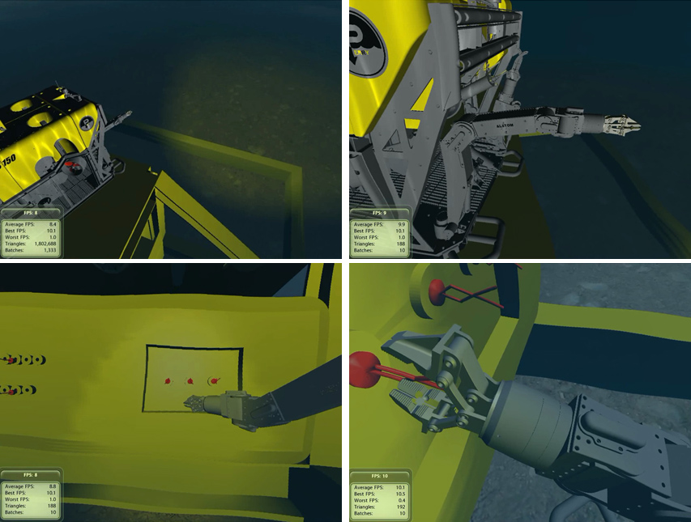

## Description

We developed a virtual environment to simulate the haptic guidance for common robotic tasks, such as approaching to the target and pushing the object, through the teleoperation system. During the operation, virtual fixtures act as rails to guide the slave robot. Also haptic feedbacks from the virtual fixtures and the physical obstacles help to prevent the human errors and enhance the task efficiency. These fixtures are well-modularized and can be easily rearranged in responding to the various task scenarios. Using this simulation environment, we can design and examine the prototypes of the virtual fixtures before the real world application.

> 
> System structure and simulation loop

> 
> Simulation of laser vision sensor (LVS) for obstacle recognition

> 
> Haptic feedback from the contact with the physical obstacles (left) and the virtual fixtures (right)

> 
> Snapshots of the simulation environments for the industrial robots (left and middle) and the underwater robots (right)

> 
> Simulation environment for remotely operated underwater vehicle (ROV) with particle-based fluid model

## Contact

Seokyeol Kim (sy.kim at kaist.ac.kr)

## Publications

- Seokyeol Kim, Hoeryong Jung, Jinah Park, "A Real-time Simulation Environment for Remotely Operated Underwater Vehicle with Particle-based Fluid Model (수중 로봇 제어 알고리즘 검증을 위한 파티클 기반의 실시간 유체 시뮬레이션 환경 구축)," ICROS 2014, pp. 168-169, May 2014.
- Seokyeol Kim, Jinah Park, "Virtual Testbed for Teleoperated Mobile Robots with Haptic Guidance (원격 로봇 제어 가이드를 위한 햅틱 시뮬레이션 환경 구축)," KCGS 2013 (한국컴퓨터그래픽스학회 2013 학술대회), pp. 221-222, June 2013. (Distinguished Paper Award)
- Seokyeol Kim, Jinah Park, "A Simulation Environment for Teleoperated Robotic Tasks with Haptic Guidance," IEEE World Haptics Conference 2013, Demonstration, April 2013.