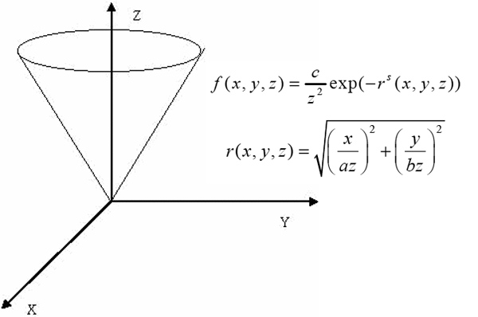
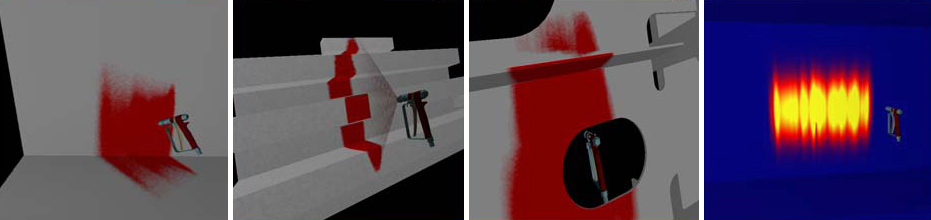

## Description

We present a real-time simulation of spray painting incorporated into a VR environment as an alternative training system for ship-building industries. The system allows the user to try out a painting work on life-size structures with a spray gun. Our goal is to provide a trainee realistic painting experience in real-time as well as to represent the thickness of the deposited paint on the surface for evaluation of his performance. The Gaussian model is used for a painting deposition model, and texture mapping technique is utilized to provide efficient visual feedback. We also present effective collision detection methods for a volume of spray paint particles.

> 

> 

## Contact

Daeseok Kim (greatstone at icu.ac.kr)

## Publications

- Daeseok Kim, Jinah Park, "Real-time Spray Painting using Rays and Texture Map (레이와 텍스처 기법을 이용한 실시간 스프레이 페인팅)," Journal of KIISE: Computing Practices and Letters (정보과학회논문지: 컴퓨팅의 실제 및 레터), Vol. 14, No. 8, pp. 818-822, November 2008.
- Daeseok Kim, Jinah Park, "Real-time Spray Painting Simulations (실시간 스프레이 페인팅 시뮬레이션에 관한 연구)," Korea Computer Congress 2007, Vol. 34, No. 1, pp. 212-213, June 2007.
- Daeseok Kim, Youngwoo Yoon, Sunyu Hwang, Geehyuk Lee, Jinah Park, "Visualizing Spray Paint Deposition in VR Training," 2007 IEEE Virtual Reality Conference (VR), pp. 307-308, March 2007.