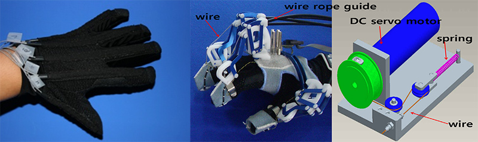
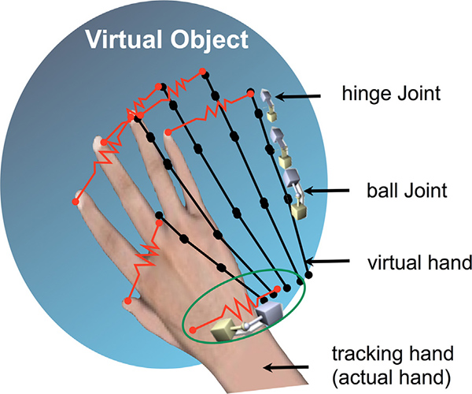
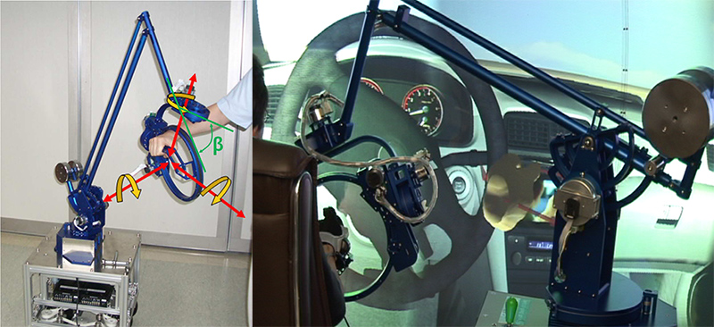
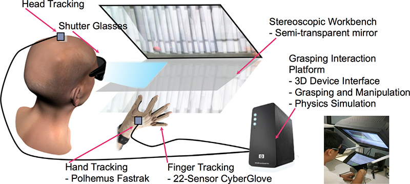
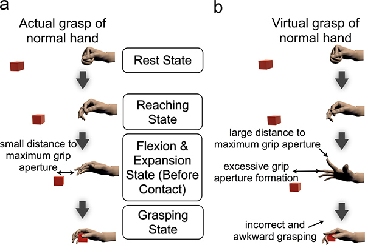
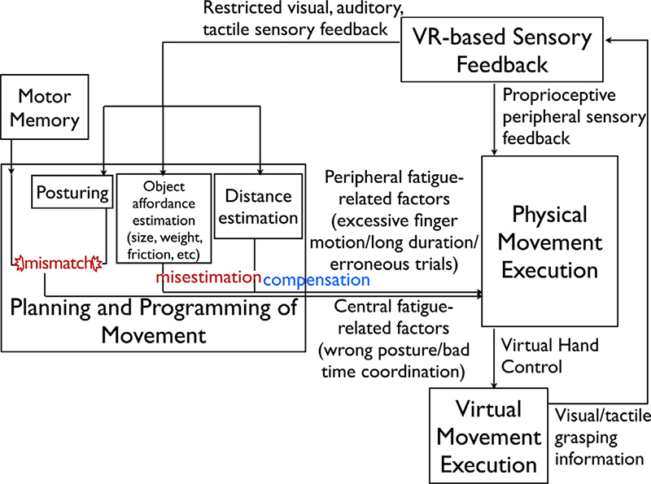

## Description

The hand penetration problem which is an effect sinking into a virtual object is the most visually distracting artifact in grasping, and it is mainly caused by the incomplete physical capabilities of haptic devices and poor grasping manipulation. To address this problem, we have developed a realistic haptic interaction system, which consists of the new 6-DOF whole-hand hardware combined with a glove-type device, and propose a hybrid grasping method which intelligently uses both heuristic and physics-based approach.

Also we have studied about 'VR interaction-induced fatigue symptom.' We argue that the source of the fatigue comes from the restricted sensory information of the VR interfaces, and that users try to accommodate the missing sensory feedback by excessive motion leading to wrong posture or bad timing. By analyzing the behaviors of users' action collected from our experiment, we derive essential factors to be considered in designing VR applications, and propose a conceptual interaction model for orchestrating virtual grasping.

> 

> 

> 

> 

> 

> 

## Contact

Yongwan Kim (messipher at kaist.ac.kr)

## Publications

- Yongwan Kim, Jinah Park, "Study on interaction-induced symptoms with respect to virtual grasping and manipulation," International Journal of Human-Computer Studies, Vol. 72, No. 2, pp. 141-153, February 2014.
- Yongwan Kim, Ki-Hong Kim, Jinah Park, "Comparison Study on Hand Interaction within Virtual Environment and Actual Environment (가상 환경에서의 핸드 인터랙션과 실 환경에서의 상호작용 비교 연구)," KCGS 2013 (한국컴퓨터그래픽스학회 2013 학술대회), pp. 199-200, June 2013.
- Yongwan Kim, Gun Lee, Dongsik Jo, Ungyeon Yang, Ki-Hong Kim, Jinah Park, "Analysis on Virtual Interaction-induced Fatigue and Difficulty in Manipulation for Interactive 3D Gaming Console," The 29th IEEE International Conference on Consumer Electronics (ICCE 2011), pp. 269-270, January 2011.
- Yongwan Kim, Jinah Park, "A Study on Virtual Assembly Simulation Using Virtual Reality Technology (가상현실 기술을 이용한 가상 조립 시뮬레이션에 대한 연구)," Journal of Korea Multimedia Society, Vol. 13, No. 11, pp. 1715-1727, November 2010.
- Yongwan Kim, Ungyeon Yang, Dongsik Jo, Gun Lee, Jinseong Choi, Jinah Park, "Efficient multi-pass welding training with haptic guide," ACM SIGGRAPH Asia Posters, Article No. 32, December 2009.
- Yongwan Kim, Jin Sung Choi, Jinah Park "Physically based grasping and manipulation method using pre-contact grasping quality measure," The 16th ACM Symposium on Virtual Reality Software and Technology (VRST 2009), pp. 253-254, November 2009.
- Yongwan Kim, Wookho Son, Jinah Park, "Two-Stage Articulated Hand Interaction for Virtual Assembly Simulation," ICCAS 2008, pp. 1280-1283, October 2008.
- Yongwan Kim, Yongseok Jang, Wookho Son, Jinah Park, "6DOF Whole-Hand Haptic Interaction System based on Hybrid Grasping Approach," EuroHaptics 2008, Lecture Notes in Computer Science, Vol. 5024, pp. 549-555, June 2008.
